# ReviewPlane

> A private, self-hosted visual collaboration, supervision and evidence platform for human-AI software development.

- Source repository: [github.com/danjonesio/reviewplane](https://github.com/danjonesio/reviewplane) (public) — all code is committed here.
- Marketing site: [reviewplane.dev](https://reviewplane.dev) — maintained outside this repository.

## Status

This repository is at project-definition stage. The documents under `docs/` are the initial product and architecture baseline. Implementations must not silently diverge from them.

## Product in one sentence

Run browser sessions centrally, watch AI coding agents interact with applications, annotate what needs changing, send durable visual reviews to CLI agents through MCP, and require verified before-and-after evidence before human acceptance.

## Core loop

```mermaid
flowchart LR
    A[Agent starts dev server] --> B[Connector publishes local service]
    B --> C[Control plane allocates browser]
    C --> D[Agent operates browser through MCP]
    D --> E[Human watches or reviews]
    E --> F[Human creates annotated review]
    F --> G[Agent retrieves named review]
    G --> H[Agent fixes and verifies findings]
    H --> I[Human accepts or reopens]
```



## Documentation map

Read in this order:

1. [`docs/PROJECT.md`](docs/PROJECT.md)
2. [`docs/PRODUCT.md`](docs/PRODUCT.md)
3. [`docs/DESIGN_PRINCIPLES.md`](docs/DESIGN_PRINCIPLES.md)
4. [`docs/DOMAIN_MODEL.md`](docs/DOMAIN_MODEL.md)
5. [`docs/ARCHITECTURE.md`](docs/ARCHITECTURE.md)
6. [`docs/SECURITY.md`](docs/SECURITY.md)
7. [`docs/PRIVACY.md`](docs/PRIVACY.md)
8. [`docs/MCP_SPEC.md`](docs/MCP_SPEC.md)
9. [`docs/CONNECTOR_PROTOCOL.md`](docs/CONNECTOR_PROTOCOL.md)
10. [`docs/EVENTS.md`](docs/EVENTS.md)
11. [`docs/API.md`](docs/API.md)
12. [`docs/REVIEW_FORMAT.md`](docs/REVIEW_FORMAT.md)
13. [`docs/UX_FLOWS.md`](docs/UX_FLOWS.md)
14. [`docs/ROADMAP.md`](docs/ROADMAP.md)
15. [`docs/DEPLOYMENT.md`](docs/DEPLOYMENT.md)
16. [`docs/CONFIGURATION.md`](docs/CONFIGURATION.md)
17. [`docs/OPERATIONS.md`](docs/OPERATIONS.md)
18. [`docs/TESTING.md`](docs/TESTING.md)
19. [`docs/DEVELOPMENT.md`](docs/DEVELOPMENT.md)
20. [`docs/GLOSSARY.md`](docs/GLOSSARY.md)
21. [`docs/adr/README.md`](docs/adr/README.md)

## Repository intent

The proposed repository structure is:

```text
.
├── apps/
│   ├── web/
│   ├── server/
│   ├── mcp-server/
│   └── browser-worker/
├── services/
│   ├── connector/
│   └── tunnel-gateway/
├── packages/
│   ├── domain/
│   ├── protocol/
│   ├── sdk/
│   ├── ui/
│   └── config/
├── deploy/
│   ├── compose/
│   ├── helm/
│   └── airgap/
├── docs/
├── examples/
├── AGENTS.md
└── CLAUDE.md
```

Only documentation and deployment scaffolding are expected until implementation begins.

## Normative language

The terms **MUST**, **MUST NOT**, **SHOULD**, **SHOULD NOT** and **MAY** are used as requirements. They are not casual emphasis.

## Naming policy

The product name is **ReviewPlane**. Use the machine identifier `reviewplane` where an identifier is required. Protocol semantics and stored object identifiers must not depend on the display name; any future rename must update visible names without changing them. The marketing site lives at `reviewplane.dev` and is not built in this repository.
