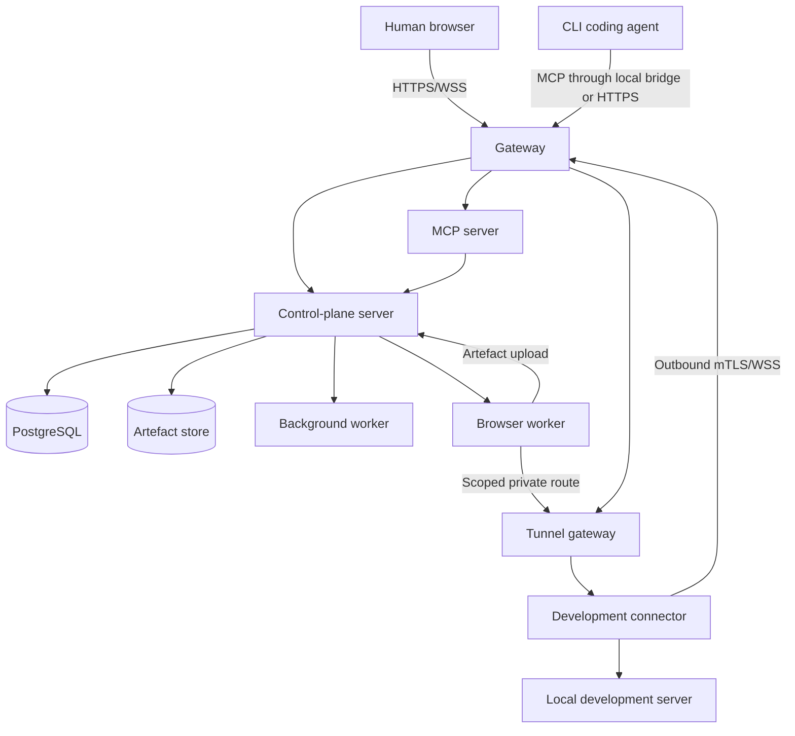
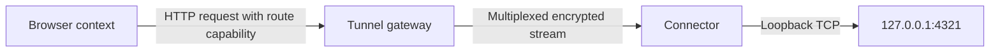

# Architecture

## 1. Scope

This document defines the target architecture for the initial product and its planned scaling path. It prioritises a reliable single-host Docker Compose deployment while preserving clean boundaries for dedicated browser workers and later orchestration.

## 2. Architectural summary

- The control plane is authoritative for projects, reviews, policies, sessions and events.
- Chromium runs in separate browser-worker containers.
- Development applications remain in development environments.
- A native connector establishes outbound authenticated tunnels.
- Agents use MCP to operate browsers and retrieve reviews.
- Humans use the web UI and WebSockets for live supervision and control.
- PostgreSQL stores authoritative metadata.
- A pluggable artefact store holds large artefacts: filesystem driver by default, S3-compatible driver optional.
- Docker Compose is the first-class deployment.

## 3. System context



## 4. Deployment units

### 4.1 Gateway

Responsibilities:

- TLS termination or integration with an external reverse proxy
- Host and path routing
- WebSocket upgrades
- Request-size and connection limits
- Security headers
- Web-application static asset serving

A bundled Caddy configuration is the preferred default. Bring-your-own reverse proxy remains supported.

The bundled configuration is `deploy/compose/gateway/`. It is the only service
in the Compose stack that publishes a host port, and it is deliberately thin: it
holds no credential, reaches no database and gets no Docker socket.

- `/api/*` and `/ws/*` proxy to the `api` service, the second carrying
  WebSocket upgrades. Idle timeouts are long enough for a live viewer watching
  a quiet page. `/mcp/*` proxies to the `mcp` service, which is a separate
  process behind a separate route (§4.4, ADR-0020), with its own body limit.
- Everything else is served from the web application's build output, with an
  unknown path falling back to the document because routing is client-side
  (ADR-0011).
- `/internal/*` is refused outright. That path is the browser-worker channel of
  `docs/API.md` section 15.1, and a misconfigured network must not be able to
  turn it into a reachable API.
- The security headers include a content-security policy that permits `self`
  only, plus `blob:` and `data:` images so a live frame can be decoded. The
  policy is strict enough to be worth having precisely because ADR-0011 forbids
  loading anything from another host.
- The web application is built inside the gateway image, since ADR-0011 removed
  the server-rendering process and the component that serves static files is
  this one.

`pnpm test:edge` starts the gateway alone and asserts its TLS, document,
refusal and header behaviour from outside; `pnpm test:install` drives `/api`,
`/ws` and `/mcp` through it to real upstreams, because a proxy rule asserted as
configuration is a proxy rule nothing has ever used.

### 4.2 Server

One codebase may initially run multiple process roles:

- `api`: HTTP API, authentication and domain logic
- `jobs`: durable background work
- `realtime`: session event fan-out if separated later

`reviewplane serve` runs `api`, and runs `jobs` beside it in a single-container
deployment; `reviewplane jobs` runs the role alone where a deployment separates
them. `REVIEWPLANE_SERVE_RUNS_JOBS=false` is how a deployment says it has
separated them, and `deploy/compose/compose.yaml` sets it, because it runs a
`jobs` container. Both runners together are safe — a claim is
`SELECT ... FOR UPDATE SKIP LOCKED`, so two of them never take the same row —
but a `jobs` container whose readiness and logs describe only some of the work
being done is worse than no separation at all. `realtime` is not separated:
event fan-out runs in the `api` process,
reading the outbox of §10, and separating it later changes which process runs
the dispatcher rather than how an event reaches a subscriber. Every role answers
`/health/live`, `/health/ready` and `/version` from one implementation
(`docs/OPERATIONS.md` §2); the `jobs` role opens a listener for those routes
alone, since it has no other.

Responsibilities:

- Projects, reviews, findings and policies
- Browser orchestration
- Authorisation
- Control leases
- Artefact metadata
- Audit and domain event creation
- Human UI backend

### 4.3 Web application

Preferred initial stack (ADR-0011):

- Vite-built React single-page application
- TanStack Router for type-safe routing
- TanStack Query for server state
- Tailwind CSS
- TypeScript

The build output is static assets served by the gateway; the web application has no server-side rendering process. All surfaces, including the live session room and annotation canvas, are client-rendered React using the HTTP API and WebSocket channels.

`apps/web` exists today with the fleet dashboard of `UX_FLOWS.md` §3, the
session room of §7, the project surfaces of §2 and the review surfaces.
Routing is code-declared TanStack Router, server state is TanStack Query, and
**both** realtime channels are framework-free clients — `src/live/client.ts`
for frames and `src/live/events.ts` for project events — so that reconnect,
stall detection, the metadata-to-payload pairing, the sequence bookkeeping and
the replay-window refresh can be tested without a browser, and so that the
annotation overlay of a later issue has the frame's declared dimensions and
sequence to work from.

The event stream seeds from `GET /api/v1/projects/:projectId/activity` before it
opens a socket, and resumes from the highest sequence it has delivered to its
consumer rather than from the highest it has seen. Acknowledging a position the
consumer never received would turn a dropped render into a permanent gap on the
next reconnect. `src/live/timeline.ts` maps an event to a row, and is the only
place that decides what a payload may show: rendering is allow-listed by member
name, so a payload that later carries a header or a token cannot reach a screen
by default.

Live frames are painted into a canvas. Page-derived content is decoded as an
image and drawn; no page-derived markup is ever inserted into the document
(ADR-0010). `pnpm --filter @reviewplane/web build` fails when the produced
bundle would fetch from another host, so ADR-0011's no-CDN requirement is a
property of the artefact rather than of review.

### 4.4 MCP server

Responsibilities:

- Expose agent tools and resources
- Authenticate agent sessions
- Scope calls to project and capability
- Translate MCP operations into domain commands
- Return structured, bounded context
- Label browser-derived content as untrusted

It may share packages and deployment image with the server but should be a separate process and route.

Stage 0 implements it as `apps/mcp-server`: its own process, its own container,
its own gateway route at `/mcp/*`, and its own image built from the same
workspace (ADR-0020). It shares the *domain* rather than the deployment: it
imports `@reviewplane/server/domain` and calls the same `ReviewService` and the
same authority rules the HTTP API calls, so a rule such as "an agent may not
finally dispose of a human-authored finding" has one implementation and two
callers.

It is the same trust zone as the server — it holds a database connection, the
worker command credential and the tunnel gateway's control credential — and a
smaller one in two ways that matter. It never reads the administrator bootstrap
token, so the agent-facing process cannot present one; and it holds no
capability signing key, so it cannot mint the credential that admits a browser
session to a route (ADR-0021). Its artefact volume is mounted read-only, because
evidence is written by the worker through the control-plane API and only read
here.

The tunnel credential is there for one operation. Revoking a published service
must reach the gateway to be a revocation at all, because the gateway verifies a
route capability from its signature without a database read. It holds no
connector control channel, so it cannot publish a route by itself: it writes the
route as `requested` and the control-plane API completes it (ADR-0021).

### 4.5 Browser worker

Responsibilities:

- Run Chromium and Playwright
- Create isolated browser contexts
- Navigate and interact
- Produce accessibility and DOM snapshots
- Capture screenshots, traces, console and network evidence
- Stream ephemeral live frames
- Apply redaction before persistence
- Enforce session limits

Browser workers are semi-trusted execution components because they process untrusted application content.

### 4.6 Tunnel gateway

Responsibilities:

- Terminate connector data channels
- Authenticate connector identity
- Register published local services
- Route browser requests using session-scoped capabilities
- Apply destination restrictions and expiry
- Carry HTTP upgrades and streamed responses (§7.4)
- Record bytes, errors, upgraded connections and route lifecycle

It must not become an unrestricted SOCKS or general network proxy. It therefore exposes no CONNECT method, refuses an absolute-form request target, and has no code path that takes an upstream destination from a request: the destination comes from the route registry alone. Carrying an HTTP upgrade does not weaken that: only the `websocket` token is carried, the handshake runs the same authorisation checks as any request, and after the switch the gateway relays bytes without letting them influence routing.

It serves three listeners, and the separation is a control rather than a convenience: the browser-facing listener is the only one a deployment publishes, the connector listener terminates mutually authenticated data channels, and the control listener carrying the route-registration API and metrics binds to loopback by default.

Connector identity is derived from the verified client-certificate chain issued by the control plane's certificate authority; the gateway holds only the authority's root and never issues. Where in the certificate the identifier is read from is configuration, so that the issuing side can change without a gateway release.

The gateway holds no database connection. Route registrations arrive from the control plane, and route lifecycle is emitted as structured audit records; the durable event rows of §10 belong to the control plane, which owns the project event sequence.

### 4.7 Connector

Preferred implementation: Go static binary.

Responsibilities:

- Enrol and maintain device identity
- Detect configured workspaces and Git state
- Publish explicitly authorised local ports
- Establish outbound tunnels
- Associate agent sessions where supported
- Report health and capabilities
- Display local notifications

The connector must not upload repository contents by default. At version 1 of
the connector protocol it cannot: the payload that carries workspace state has
members for repository identity, branch, head commit, a boolean dirty state, a
display label and a path hash, and no member capable of carrying file contents,
a changed-path list or a full filesystem path (`CONNECTOR_PROTOCOL.md` §9,
ADR-0022). "Detect configured workspaces" is also literal — only paths an
operator configured are ever read, and no directory walk exists in the
connector.

### 4.8 Background worker

Responsibilities:

- Thumbnail generation
- Retention enforcement
- Export generation
- Artefact integrity checks
- Staleness analysis
- Notification fan-out
- Cleanup of abandoned sessions and routes

Initial durable jobs may use PostgreSQL row locking. A separate message broker is deferred until measured load requires it.

The `jobs` table is that decision made concrete. A runner claims with
`SELECT ... FOR UPDATE SKIP LOCKED`, so two runners never take the same row and
adding a runner adds throughput rather than contention. A claim also takes a
lease (`locked_until`): a runner whose transaction is rolled back by the server
releases its lock at once, and a runner that vanishes without the database
noticing costs a lease's delay instead of stranding the job — which is what §14's
"recover durable jobs" asks of a control-plane restart. Attempts back off
exponentially and a job that exhausts them is dead-lettered as `failed`.
Enqueuing takes a transaction rather than a pool, so scheduling work and making
the change that needs it commit together, and every terminal outcome writes a
`job.*` event (`docs/EVENTS.md` §7).

## 5. Data architecture

### 5.1 PostgreSQL

Authoritative data:

- Organisations and users
- Projects and environments
- Connectors and workspaces
- Agent and browser sessions
- Reviews, findings, comments and verification
- Control leases
- Policies and approval records
- Artefact metadata
- Domain and audit events
- Durable jobs

Use transactions to maintain domain invariants. Multi-step commands must produce state and event records atomically where practical.

### 5.2 Artefact store

Artefact storage is accessed only through an internal storage-driver interface (ADR-0012). The `filesystem` driver is the default and writes to a single data-directory volume; the `s3` driver targets any S3-compatible endpoint for customer-owned or external storage. Browser workers upload artefacts through the control-plane artefact API and hold no storage credentials.

Stores:

- Original screenshots
- Derived thumbnails
- Traces
- HAR and logs
- DOM and accessibility snapshots when too large for PostgreSQL
- Video when enabled
- Review exports

Artefact keys are content-addressed and must not expose user-entered names. Where the `s3` driver issues presigned URLs, they must be short-lived and scoped; the `filesystem` driver serves artefacts through the server with equivalent short-lived, scoped access tokens.

Content addressing has one consequence worth stating: **two artefacts with identical bytes are one stored object**. A before and an after screenshot of an unchanged region share a key, so deleting one must not remove the object while the other still references it. The delete path asks that question inside the transaction that marks the metadata row deleted, and removes the object only afterwards; a crash between the two leaves an unreferenced object, which is wasted disk, rather than a live artefact whose bytes have gone.

Both drivers are exercised by one conformance suite (`apps/server/test/artefact-driver-conformance.test.ts`), which ADR-0012 requires. The `s3` run signs against an in-process S3-compatible endpoint that recomputes the signature over every request, so it tests the driver's own canonicalisation and encoding rather than agreeing with whatever it is sent; testing against an external service is a later stage (`docs/DEPLOYMENT.md` §12).

Under both drivers Stage 1 **proxies the upload**. ADR-0012 permits a presigned upload URL under `s3` and this build does not issue one, because the server is where content-type validation happens and a presigned upload would place unvalidated bytes in the bucket before anything examined them. Retrieval does use a presigned URL under `s3`, which is what ADR-0019 decided; the grant row is written and audited either way.

Those tokens are the access grants of ADR-0019: a caller mints one for a single artefact and reads it at `/api/v1/artefact-content/:grantId`, and the grant is bound to the subject that minted it, so the identifier in the URL is not a credential on its own. No route serves an artefact from its identifier under either driver.

For an image artefact the store also records the **content rectangle** — the intrinsic pixel extent the server measured from the verified bytes. Annotation geometry is normalised against it (`docs/DOMAIN_MODEL.md` section 16), so it belongs with the artefact rather than being recomputed by every renderer.

### 5.3 Ephemeral data

- Live browser frames
- Browser process temporary directories
- Short-lived command acknowledgements
- In-flight tunnel buffers

Ephemeral data must not be persisted unless a configured recording policy converts it into an artefact.

For live frames specifically, "must not be persisted" is enforced by the shape
of the code rather than by a retention job. A frame exists as a value between
the CDP callback and a socket write: the worker never writes one to its
filesystem or hands one to the artefact uploader, the control plane never
writes one to PostgreSQL or to the artefact store, and neither logs one. Stage
0 implements no recording policy at all, so there is no configuration that can
turn a frame into an artefact; when one arrives it must be an explicit,
audited conversion rather than a flag on this path. `docs/TESTING.md` sections
7 and 10 hold the tests that check the filesystem, the database and the
artefact store after a sustained viewing session.

## 6. Browser topology

### 6.1 Central workers

The initial architecture uses centrally managed browser workers rather than Chromium installed in each development VM.

Benefits:

- Consistent browser and Playwright versions
- Central live viewing
- Easier isolation and resource management
- Simpler updates
- Agent-independent access
- Central evidence capture

### 6.2 Worker isolation

Initial isolation:

- Dedicated non-root container user
- Read-only base filesystem where practical
- Per-session temporary directory
- Playwright browser context isolation
- Resource limits
- No host Docker socket
- No access to control-plane secrets
- Explicit network routes only

A browser session is allocated as a Playwright persistent context over its own ephemeral profile directory, which gives it its own browser process as well as its own context. That is one step short of the container-per-session option below and satisfies both the per-session temporary directory and the context-isolation requirements with one mechanism. Termination closes the browser and removes the directory.

"Explicit network routes only" is enforced by the worker: navigation and subresource requests are restricted to the origin of the session's published service, so a session with no published service reaches nothing. `docs/SECURITY.md` section 10.1 records the container controls that carry the rest.

Higher-assurance deployments may allocate one container or microVM per browser session later.

### 6.3 Live viewing

Use CDP screencast frames or equivalent browser-worker capture:

- Fleet thumbnails: approximately 2 to 5 frames per second
- Open session room: adaptive 10 to 20 frames per second
- Human takeover: increased rate as resources allow
- Frame quality and dimensions adapt to bandwidth
- Frames are dropped rather than queued when viewers fall behind

Live frames are ephemeral and delivered over authenticated WebSockets.

### 6.3.1 How the rates and the drop policy are implemented

The path is worker to control plane to viewer, and each hop has one job.

**The worker produces.** A CDP screencast is started per browser session, at
most one at a time. Its scheduler (`apps/browser-worker/src/session/quality.ts`)
owns rate, encoder quality and dimensions, and never leaves the band its mode
declares: 10 to 20 frames per second for `session_room`, 2 to 5 for
`thumbnail`. A viewer request may lower a ceiling — a viewer that cannot
consume the floor is better served slowly than not at all — and can never
raise one. Chromium paints when it likes, so frames arriving faster than the
target interval are acknowledged and declined; a declined frame never becomes
part of the stream and never takes a sequence number, which keeps the drop rate
a statement about the viewer rather than about the page's paint rate. Frames
that do enter the stream sit in a buffer two frames deep; when it is full the
oldest goes, and the count of discarded frames rides on the next delivered
frame's metadata.

**The transport between them** is an HTTP response body rather than a
WebSocket, framed as a one-byte record kind, a four-byte big-endian length and
the bytes. It carries the same `live_view` messages the viewer receives, so
there is one message definition and not two. Abandoning that response is the
only way to stop the producer: there is no "stop" message, which means a
control plane that crashes cannot leave a worker streaming to nobody. A viewer
quality request travels as a separate short request rather than upstream on
this body, so nothing can interleave with a frame payload.

**The control plane relays.** One worker stream per browser session is fanned
out to every attached viewer, so a second viewer costs the worker nothing.
Each viewer is bounded independently: a viewer with bytes still outstanding
does not receive the current frame and its drop counter advances. That costs a
constant amount of memory per viewer, always favours the newest frame, and
stops one slow viewer thinning the stream for the others. When the last viewer
detaches the worker stream is closed immediately rather than swept by a timer.

### 6.4 Human input

Human keyboard and pointer input is sent through the control plane to the worker. Every command includes:

- Browser session ID
- Controller identity
- Control epoch
- Sequence number
- Timestamp

Stale epochs are rejected.

These five fields are the envelope of every browser command, not only of human input: they are declared once in `packages/protocol/schemas/browser/v1.schema.json` and required by the generated validators on both sides, so a command cannot omit one. The control plane checks them before dispatch and the worker checks them again before touching a page. An epoch that is not the current one is rejected whether it is older or newer, and a sequence number that is not greater than the last accepted one is rejected as a replay. Non-interactive system capture is authorised without the interactive lease and never transfers it.

**The controller identity is derived from the authenticated actor and is never
taken from a request.** It was a field of the `docs/API.md` §11 command body
until RVP-30, which made it a claim *about* the actor rather than the actor: the
lease-ownership check could be satisfied by naming its owner. The control plane
now derives it — a human acts as the `system` controller bound to their session,
an agent as its own agent session — and a body that still carries one is refused
(ADR-0028).

**All six checks of `SECURITY.md` §7 run in the control plane before dispatch**,
not only the epoch and the session state. The worker repeats what it can, and
one check it structurally cannot make: its egress policy is fixed when its
context is created and §6.2 forbids widening it afterwards, so a route that has
been revoked, has expired or no longer authorises this session is invisible to
the worker while its origin still resolves. That check has to be here.

Every refusal — stale epoch, foreign project, non-owning controller, wrong
session status, missing worker, unassociated route, policy denial — is recorded
as `browser.command_rejected`. `SECURITY.md` §8 requires a rejected command to be
logged as well as refused, and a denial that is correct and unrecorded is
indistinguishable from an attempt that never happened.

## 7. Development-service routing

### 7.1 Problem

A central browser cannot reach `localhost` on a remote development VM directly.

### 7.2 Solution

The connector publishes a local service through an outbound tunnel.



### 7.3 Route properties

- Project scoped
- Browser-session scoped
- Short-lived
- Host and port restricted
- Protocol declared
- Audited
- Revocable immediately

The browser receives an internal origin:

```text
https://public-alias.internal.invalid/
```

The leftmost label is the published service's `public_alias` (`DOMAIN_MODEL.md` §10), not its identifier: a conventional `svc_` identifier is not a valid DNS label. The alias MUST be a DNS label and MUST be unique across the deployment, and it is validated at registration rather than normalised at request time, so the mapping from origin to route is total and injective.

The gateway resolves an origin by dropping any port, dropping a trailing dot and lowercasing; what remains MUST be exactly one label followed by the configured suffix. Anything else resolves to no route. Host and origin handling MUST be deterministic and documented; the forwarding rules are in `CONNECTOR_PROTOCOL.md` §13.

"Revocable immediately" includes connections that are already open. A route that expires or is revoked closes every stream it is carrying, including an HTTP connection that has been upgraded to a WebSocket, and no stream's deadline may exceed its route's expiry. A long-lived connection is not a way to hold access open past the route that authorised it (ADR-0017, `CONNECTOR_PROTOCOL.md` §13.3).

### 7.5 What the publication path does today

The publication half of §7.2 is implemented and is exercised end to end against the real connector binary by `apps/server/test/route-publication.test.ts`:

1. `POST /api/v1/projects/:projectId/published-services` resolves the project inside the caller's scope, validates the destination against the control plane's own policy before any row exists (`SECURITY.md` §9), writes the record as `requested` and records `published_service.requested`. The same first phase serves `development_service_publish`, which an agent calls on a process that holds no connector channel (ADR-0021).
2. The control plane sends `route.publish` down the control channel the connector already holds open, and waits, bounded, for the acknowledgement (`CONNECTOR_PROTOCOL.md` §11). No channel is `CONNECTOR_OFFLINE`; no answer is `CONTROL_PLANE_UNAVAILABLE`.
3. The connector validates independently against its own configuration, probes the destination within a bounded startup grace, and answers `ready` with the destination it observed or `rejected` with a stable class.
4. Only then is the route registered with the tunnel gateway, the record becomes `ready`, and `published_service.ready` is recorded. A refusal at any step leaves the record `failed` carrying the class, never free text.

The connector opens no listening socket at any point, which the same test asserts with `ss -ltnp` while a route is being carried.

Capabilities are minted by the control plane and verified by the gateway. A capability is opaque to its bearer, binds route, project and browser session, expires, and is revocable individually as well as through its route. "The control plane" is narrower than it sounds: the signing key is held by the process that serves the API and drives browser sessions, and the MCP endpoint is built without it, so the process an agent talks to cannot mint (ADR-0021). That endpoint may **withdraw** a capability and still cannot mint one, which is ADR-0021's carve-out for `development_service_unpublish` extended to the credential rather than only to the route.

A capability's lifetime is bounded by the route's **and by its browser session's**: `min(now + requested_ttl, route.expires_at, session.created_at + session.limits.max_duration_seconds)`. A credential that outlived the browser it was minted for is one nobody is accounting for, and this bound is the only part of the guarantee that holds without the gateway's cooperation (ADR-0037).

**Individual revocation is best effort, and the sentence above is stronger than the deployment.** Ending a browser session — by termination, by a failed reservation, or by a worker-reported failure — marks that session's live capabilities revoked and tells the gateway, in that order: marking a record closed while the gateway still carried it would turn a closure into a claim. But the gateway verifies a capability from its signature without a database read, and its revocation set is held in memory and does not survive a restart (RVP-76). So a revocation is durable in the control plane and not necessarily at the gateway: a deployment that restarts its gateway between a revocation and a capability's natural expiry has a revoked capability the gateway would accept again. The TTL bound above is what limits that window; RVP-99 is what closes it. Read this paragraph and not the sentence above for the guarantee.

An agent reaches the same publication path through `development_services_list`, `development_service_publish` and `development_service_unpublish` (`MCP_SPEC.md` §7.2). Those tools take no connector, no project and no browser session: all three are resolved from the agent session, because a caller that could name any of them would be choosing which development machine the central browser reaches.

The browser worker receives its session's capability in the allocation message and presents it as `X-ReviewPlane-Capability` on every request to the session's origin, and on no other request. The gateway strips the whole `X-ReviewPlane-` namespace before forwarding, so the credential never reaches the development service. How Chromium resolves an internal origin and trusts the gateway's certificate is ADR-0015.

### 7.4 Application compatibility

The tunnel must support HTTP/1.1, WebSockets, HTTP streaming, server-sent events and development hot reload. Every one of them is implemented and has a passing integration test; nothing in this list is aspirational.

| Capability | State | Proven by |
|---|---|---|
| HTTP/1.1 | Implemented | `services/tunnel-gateway/internal/gatewayhttp/proxy_test.go`, and the Compose scenario `deploy/compose/e2e/run.sh` |
| WebSockets | Implemented | `services/tunnel-gateway/internal/gatewayhttp/websocket_test.go`; a browser-driven echo in the Compose scenario |
| HTTP streaming | Implemented | `services/tunnel-gateway/internal/gatewayhttp/streaming_test.go`, chunked delivery asserted on arrival timing |
| Server-sent events | Implemented | the same file, asserted on arrival timing rather than final content |
| Development hot reload | Implemented | the Compose scenario applies a source edit on the development machine to a page in central Chromium without a full reload |
| Configurable upstream TLS | Not implemented | Stage 0 targets plain loopback HTTP. The destination policy accepts `https` and the connector opens a TCP socket either way, but nothing negotiates TLS to the development service. |

The hot-reload case is the one that matters most and is the easiest to get quietly wrong: if the update socket fails, the page in Chromium stops updating while still looking live, so a human annotates a stale render and an agent verifies against one.

An HTTP upgrade is carried as `websocket` and nothing else. HTTP/2 and QUIC are deferred; an `h2c` upgrade is refused with `UNSUPPORTED_CAPABILITY` rather than partially supported. gRPC, WebTransport and raw TCP forwarding are excluded — the last permanently, by `SECURITY.md` §9.

`CONNECTOR_PROTOCOL.md` §13.3 records the header modes, the timeout and buffer values and the closure semantics; ADR-0017 records why the lifetime model is an idle window bounded by the route rather than a flat lifetime.

## 8. Agent integration

### 8.1 MCP

MCP is the initial agent-facing interface.

Supported connection forms:

- Local stdio bridge installed with the connector
- Remote authenticated HTTP endpoint

The local bridge is preferred where the CLI client handles local MCP configuration more reliably. It authenticates to the control plane using scoped device or session credentials.

Both forms are implemented. The remote endpoint is ADR-0020; the local bridge is
`reviewplane-connector mcp`, which exchanges the connector's device identity for
a short-lived, single-project agent credential (ADR-0023) and proxies JSON-RPC
between the agent's stdin and stdout and that same endpoint. The bridge is a
transport in front of this interface and not a second one: it presents the same
credential kind, meets the same authorisation, and receives the same envelopes.

### 8.2 Agent knowledge

Agents learn when to use the product through:

1. Repository instructions in `AGENTS.md` and client-specific files
2. MCP tool descriptions
3. Project policies and completion gates
4. Inbox checks at safe workflow boundaries

Tool descriptions assist selection. Policy and completion gates enforce required evidence.

### 8.3 Capability negotiation

Agent sessions advertise capabilities such as:

```json
{
  "mcp_tools": true,
  "mcp_resources": true,
  "image_resources": true,
  "managed_messages": false,
  "session_resume": true
}
```

The control plane must degrade clearly when a client cannot consume image resources or managed notifications.

Negotiation is through query parameters on the MCP endpoint URL, because MCP's
own handshake has nowhere to carry them (`docs/MCP_SPEC.md` section 3.2), and
the negotiated result is reported back in `agent_session_status`. Degradation is
a warning on a successful call and never a failure: a client that cannot consume
image content still retrieves the review, still claims the finding, still
captures the after screenshot and still submits verification, receiving resource
links, digests and an `image_content_unsupported` warning instead of pixels
(`docs/MCP_SPEC.md` section 14.2).

Degradation is per capability. `review_inbox` is `true` whatever the client's
image capability, because an inbox item carries a title and identifiers rather
than pixels: a client without image support still receives its work.

`managed_messages` is `false`. Nothing is pushed to an agent, which is why the
inbox workflow of `docs/MCP_SPEC.md` section 9 is a poll at named checkpoints
and an explicit acknowledgement rather than a delivery. It is stated rather than
left to be discovered.

## 9. Review architecture

The review service owns:

- Review lifecycle
- Finding lifecycle
- Annotation storage
- Assignment
- Staleness calculation
- Verification submission
- Human acceptance
- Comment history
- Review export

Review commands are idempotent where network retries are likely. Human and agent actions produce immutable events.

The lifecycle rules live **below the transport**, in
`apps/server/src/modules/reviews/domain.ts`, as pure functions over a status, an
actor type and a finding's source. The HTTP routes and the MCP server both call
the same service, so "a human-authored finding cannot be finally accepted by an
agent" is a property of the domain rather than of a handler, and a future caller
— an internal job, a second transport — inherits it rather than having to
reimplement it. The MCP layer additionally cannot *express* the request
(ADR-0020); the two are not duplicate implementations of one rule but a removed
vocabulary and a refused act.

The tables those rules read are not in the service either. Both status machines,
with the actor types permitted to request each transition, are data in
`packages/protocol/schemas/review/v1.schema.json` (ADR-0024), so the control
plane, the MCP layer and the web application derive permitted actions from one
source instead of three copies that can drift.

Export is a durable job rather than work done inside a request
(section 4.8). A review with its findings, comments and artefact manifest is not
something to build while a caller holds a socket open, and a job survives the
restart a long request would not. The whole attempt is one transaction, so an
export is either `ready` with an artefact, a digest and a size, or it is not
`ready` at all: a partial artefact is not a state the schema admits.

## 10. Event architecture

The system uses an append-only event table for:

- Audit
- Session timeline
- Integration delivery
- Operational diagnosis

Current state remains in normalised tables. Events do not require full event sourcing of all aggregates.

Real-time updates:

1. Command commits state and event in PostgreSQL
2. A notifier publishes committed event IDs
3. Realtime process fetches and broadcasts authorised payloads
4. Clients resume using last seen sequence

A PostgreSQL notification mechanism is acceptable initially. Later brokers must preserve event ordering semantics.

The four steps are implemented as: `recordStateChange`, which commits the state
change, the event and an `event_outbox` row in one transaction; the outbox
dispatcher, which claims pending rows with `FOR UPDATE SKIP LOCKED` after
commit; the in-process bus it delivers them to; and
`/ws/v1/projects/:projectId/events`, which replays from a client's sequence and
then hands over to live delivery.

Step 2 is an optimisation rather than the mechanism: a commit nudges the
dispatcher, and its absence delays delivery instead of losing it. That is what
the outbox row buys — a process that dies between commit and delivery leaves the
obligation behind, and the next dispatcher discharges it. Delivered rows are
pruned, because the audit history is `events` and a second permanent copy of it
would be a second thing to retain, redact and erase under `docs/EVENTS.md` §12.

## 11. Authentication and authorisation

### Human

Initial:

- Local accounts
- Secure session cookies
- Optional bootstrap administrator token

Stage 1 implements the first two. A local account is established once from a
one-time installation token minted by `reviewplane install-token`, and
authenticates with a password; the session it issues is the record ADR-0016
introduced, now bound to a user and carrying a CSRF token
(`docs/SECURITY.md` section 6.1, `docs/API.md` section 4.0).

The bootstrap administrator token remains, as this list says it may: it is the
machine credential the worker channel, the provisioning routes and the operator
harnesses use. It resolves to an organisation-wide human principal, so it reaches
the same routes an administrator's account session does, including the
state-changing browser-session routes of `docs/API.md` §11 — which is what lets
an operator drive a session from a script. The CSRF rule does not apply to it and
does not need to: CSRF exists because a browser attaches a **cookie** to a
request another origin caused, and nothing attaches a bearer token that way. What
the token cannot do is authenticate as a project-scoped session, and what a
project-scoped session cannot do is administer the organisation — assign a
browser worker, read the fleet, or read the worker protocol example.

Later:

- OIDC
- SAML through enterprise integration
- MFA policy through identity provider

### Connector

- One-time enrolment token
- Device key pair generated locally
- Issued client certificate or equivalent signed identity
- mTLS or cryptographically bound channel
- Revocation support

The mechanism is ADR-0014: a control-plane certificate authority, generated at bootstrap and persisted server-side, issues one X.509 client certificate per connector. Its private key never leaves the control plane; the CA certificate is exported so that the tunnel gateway can verify the same identities. Stage 0 terminates the connector channels on a dedicated mutually authenticated listener rather than behind the shared gateway of §4.1, because the human API does not request client certificates.

### Browser worker

A browser worker presents its own credential, which is not the administrator
token and is accepted on the internal worker channel and nowhere administrative
(`docs/SECURITY.md` §6.4). It is scoped to the projects an administrator has
assigned to it; there is no wildcard, and an unassigned worker serves nothing.

**The assignment is restated on every heartbeat** (ADR-0026), so an assignment
added or removed takes effect within one heartbeat interval rather than at the
worker's next restart. A removal also terminates the sessions the worker is
running for that project: a browser session is a live window into a development
machine held open by an authorisation that has just been withdrawn, and letting
it run to its duration limit would mean the withdrawal took up to two hours to
become true. Evidence already uploaded is untouched.

The control plane keeps the authority. The worker's copy is a cache and never a
source: allocation is refused against the control plane's record before the
worker is contacted, and refused again by the worker on arrival.

Worker liveness is a swept state and a term in every query that decides something
(ADR-0027, `docs/OPERATIONS.md` §8.1).

### Agent

- Agent session token bound to connector, project and capabilities
- Short lifetime
- Not reusable as a human token

Stage 0 implements this as an administrator-issued agent credential (ADR-0020):
a bearer token prefixed `rpa_`, stored only as a digest, bound to one
organisation and a non-empty set of projects, carrying a non-empty capability
set, and expiring at most 24 hours after issue. The connector binding arrives
with the connector.

"Not reusable as a human token" is symmetric and enforced in three places: the
administrative API refuses an `rpa_` token by shape before any lookup, the agent
credential store resolves nothing that is not an agent credential, and the
viewer-session store resolves nothing that is not a viewer session. Neither
principal can be presented as the other.

### Browser worker

- Worker identity and mutual authentication
- Commands signed or sent over mutually authenticated internal channels
- Worker restricted to assigned projects and sessions

Stage 0 implements the mutual authentication as two distinct credentials on an internal network, one per direction: the worker presents its own credential to the control-plane API, and the control plane presents a different credential to the worker's listener. Neither is an administrator token, neither works in the other direction, and neither is accepted on an administrative endpoint. A worker may only receive sessions for projects an administrator has assigned to it; an unassigned worker serves nothing. Mutual TLS replaces the shared credentials when remote worker nodes arrive in Stage 3.

## 12. Technology baseline

Initial preferred technologies:

| Area | Choice |
|---|---|
| Monorepo | pnpm workspaces with task runner as needed |
| Web | Vite React SPA, TanStack Router/Query, Tailwind CSS, TypeScript |
| Server | TypeScript on current pinned LTS Node runtime |
| HTTP | Fastify or equivalent schema-first framework |
| Browser | Playwright with Chromium |
| Connector | Go |
| Database | PostgreSQL |
| Artefact store | Filesystem driver default; S3-compatible driver optional |
| Realtime | WebSockets |
| Deployment | OCI containers and Docker Compose |
| Schemas | JSON Schema 2020-12 in `packages/protocol`, with generated TypeScript and Go models (ADR-0013) |

Specific libraries require ADR when they shape public interfaces or operational dependencies.

## 13. Scaling path

### Stage 1

Single host:

- One server deployment
- One MCP process
- One job worker
- One browser worker
- Bundled PostgreSQL and filesystem artefact storage

`deploy/compose/compose.yaml` is that deployment: `api`, `mcp`, `jobs`,
`browser-worker`, `postgres` and `gateway`, plus `tunnel-gateway` for the route
capabilities of §7. Installation is `docs/DEPLOYMENT.md` §8 and nothing else.

### Stage 2

Production Compose:

- External PostgreSQL and S3-compatible artefact storage optional
- Multiple browser-worker processes on one host
- Separate realtime and job processes

### Stage 3

Remote worker nodes:

- Browser workers register outbound
- Control plane schedules based on capacity and labels
- Workers use short-lived session credentials

### Stage 4

Kubernetes:

- Stateless API, MCP and workers as Deployments
- Browser workers scheduled with dedicated resource limits
- External or operator-managed PostgreSQL and S3-compatible artefact storage
- Helm chart

Kubernetes is not an MVP requirement.

## 14. Failure handling

### Connector disconnect

- Mark routes unavailable
- Pause affected browser actions
- Retain review and session metadata
- Attempt bounded reconnect
- Do not redirect traffic to a different environment silently

Unavailable is not revoked. The published-service record survives the outage, and a route that has not expired and is still authorised resumes under the same identifier when the connector returns (`CONNECTOR_PROTOCOL.md` §17), so an outage costs a pause rather than a re-publication. A request made while the connector is gone fails with `CONNECTOR_OFFLINE` or `PUBLISHED_SERVICE_UNAVAILABLE` (`MCP_SPEC.md` §12) — including a request that was already in flight when the channel dropped, which fails with the same code rather than a generic upstream error and never hangs. Affected browser sessions become `DEGRADED` (`DOMAIN_MODEL.md` §12) and return to a usable status when reconciliation continues their route; they are never terminated by a connector outage.

"Do not redirect traffic to a different environment silently" is enforced at the reconciliation, not only at publication: a connector that reconnects claiming a destination the record does not name has that route closed rather than continued, and a connector that reconnects under a different identity inherits no routes at all.

The reconnect is bounded and jittered (`DEVELOPMENT.md` §10). The attempt counter that grows the backoff bounds *consecutive* failures rather than the connector's lifetime: a channel that stayed up longer than the longest backoff delay ends the incident, so a connector connected for hours does not retry its next unrelated drop at the maximum delay. A channel that is accepted and immediately dropped does not reset it, so a flapping peer is still backed off from.

### Browser worker crash

- Mark session degraded or failed
- Preserve uploaded evidence
- Revoke control lease
- Offer fresh session allocation
- Restore storage state only when explicitly configured

### Control-plane restart

- Recover durable jobs
- Expire stale leases
- Resume event delivery from sequence
- Reconcile workers and connectors

### Artefact upload failure

- Keep finding verification incomplete
- Retry with content hash and idempotency key
- Never record an artefact as available before integrity verification

Two failures are distinguished, because they call for opposite responses. Bytes
that do not match what the intent declared are the uploader's fault: the
artefact becomes `failed`, `artefact.upload_failed` is recorded, and retrying
the same intent would be wrong because it describes something the uploader did
not send. A store that cannot accept a write or answer a read is not the
uploader's fault: the artefact keeps the state it had, the refusal is
`ARTEFACT_STORE_UNAVAILABLE` carrying `details.reason =
"artefact_store_unavailable"`, and the same intent and idempotency key remain
retryable. Marking a store outage `failed` would turn a transient fault into
lost evidence, and answering it with `ARTEFACT_UPLOAD_INCOMPLETE` would send an
operator to examine an upload that had in fact completed. Neither outcome makes
anything available, and the database constraint
`artefacts_available_is_verified` means a bug in this code cannot either.

Neither refusal names the store. A filesystem error carries an absolute server
path and an S3 error carries the bucket endpoint and a fragment of the service's
own XML; `docs/SECURITY.md` §18 keeps both out of a response, and the control
plane logs them against the request identifier instead.

The idempotency key is the `Idempotency-Key` header on the upload intent. A
worker that crashed after uploading and before completing resumes the artefact
it already created rather than starting a second one; a worker that crashed
before uploading retries the whole flow and gets the first intent back.

"Keep finding verification incomplete" applies at submission as well as at
upload, and applies to a store that has gone away *since* the upload succeeded.
The artefact rows say the bytes were verified when they arrived; they do not say
the store can be reached now. `finding_submit_verification` therefore proves the
store answers a round trip before it records anything, and refuses with
`ARTEFACT_STORE_UNAVAILABLE` when it does not: no verification row, no event,
and the finding keeps the status it had. Recording the claim optimistically
would produce a completion claim whose before-and-after pair nobody can open,
which is the one thing the record exists to make possible. The same submission
succeeds unchanged once the store returns, and the refusal names no path or
bucket.

### Database unavailable

- Reject state-changing actions safely
- Browser workers may terminate or pause after a bounded grace period
- Do not continue unaudited destructive operations

## 15. Observability

Every service emits:

- Structured logs
- Metrics
- Trace correlation identifiers
- Version and capability information
- Health and readiness endpoints

Sensitive values must not appear in logs.

Core correlation IDs:

- Request ID
- Event ID
- Project ID
- Agent session ID
- Browser session ID
- Review ID
- Finding ID
- Connector ID

## 16. Deferred architecture

Not in the initial architecture:

- Full desktop VNC streaming
- Multi-browser support
- Generic internet proxying
- Direct terminal prompt injection
- Built-in LLM hosting
- General multi-agent scheduler
- Full event-sourced state reconstruction
- Service mesh
- Mandatory distributed broker
- Kubernetes-only deployment
