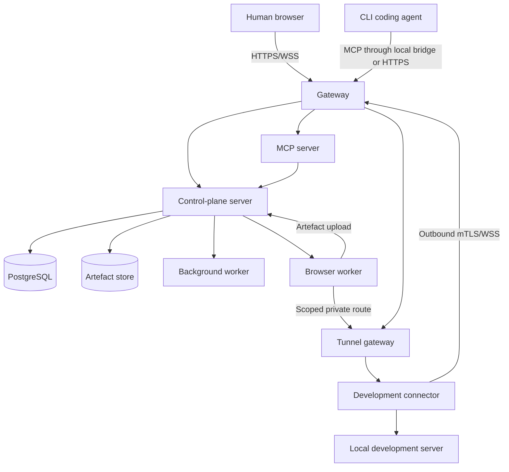
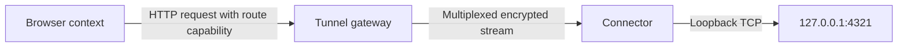

# Architecture

## 1. Scope

This document defines the target architecture for the initial product and its planned scaling path. It prioritises a reliable single-host Docker Compose deployment while preserving clean boundaries for dedicated browser workers and later orchestration.

## 2. Architectural summary

- The control plane is authoritative for projects, reviews, policies, sessions and events.
- Chromium runs in separate browser-worker containers.
- Development applications remain in development environments.
- A native connector establishes outbound authenticated tunnels.
- Agents use MCP to operate browsers and retrieve reviews.
- Humans use the web UI and WebSockets for live supervision and control.
- PostgreSQL stores authoritative metadata.
- A pluggable artefact store holds large artefacts: filesystem driver by default, S3-compatible driver optional.
- Docker Compose is the first-class deployment.

## 3. System context



## 4. Deployment units

### 4.1 Gateway

Responsibilities:

- TLS termination or integration with an external reverse proxy
- Host and path routing
- WebSocket upgrades
- Request-size and connection limits
- Security headers
- Web-application static asset serving

A bundled Caddy configuration is the preferred default. Bring-your-own reverse proxy remains supported.

The bundled configuration is `deploy/compose/gateway/`. It is the only service
in the Compose stack that publishes a host port, and it is deliberately thin: it
holds no credential, reaches no database and gets no Docker socket.

- `/api/*` and `/ws/*` proxy to the control plane, the second carrying
  WebSocket upgrades. Idle timeouts are long enough for a live viewer watching
  a quiet page.
- Everything else is served from the web application's build output, with an
  unknown path falling back to the document because routing is client-side
  (ADR-0011).
- `/internal/*` is refused outright. That path is the browser-worker channel of
  `docs/API.md` section 15.1, and a misconfigured network must not be able to
  turn it into a reachable API.
- The security headers include a content-security policy that permits `self`
  only, plus `blob:` and `data:` images so a live frame can be decoded. The
  policy is strict enough to be worth having precisely because ADR-0011 forbids
  loading anything from another host.
- The web application is built inside the gateway image, since ADR-0011 removed
  the server-rendering process and the component that serves static files is
  this one.

### 4.2 Server

One codebase may initially run multiple process roles:

- `api`: HTTP API, authentication and domain logic
- `jobs`: durable background work
- `realtime`: session event fan-out if separated later

Responsibilities:

- Projects, reviews, findings and policies
- Browser orchestration
- Authorisation
- Control leases
- Artefact metadata
- Audit and domain event creation
- Human UI backend

### 4.3 Web application

Preferred initial stack (ADR-0011):

- Vite-built React single-page application
- TanStack Router for type-safe routing
- TanStack Query for server state
- Tailwind CSS
- TypeScript

The build output is static assets served by the gateway; the web application has no server-side rendering process. All surfaces, including the live session room and annotation canvas, are client-rendered React using the HTTP API and WebSocket channels.

`apps/web` exists today with two surfaces: a list of active browser sessions
and a session's live view. Routing is code-declared TanStack Router, server
state is TanStack Query, and the live channel is a framework-free client in
`src/live/client.ts` so that reconnect, stall detection and the
metadata-to-payload pairing can be tested without a browser — and so that the
annotation overlay of a later issue has the frame's declared dimensions and
sequence to work from.

Live frames are painted into a canvas. Page-derived content is decoded as an
image and drawn; no page-derived markup is ever inserted into the document
(ADR-0010). `pnpm --filter @reviewplane/web build` fails when the produced
bundle would fetch from another host, so ADR-0011's no-CDN requirement is a
property of the artefact rather than of review.

### 4.4 MCP server

Responsibilities:

- Expose agent tools and resources
- Authenticate agent sessions
- Scope calls to project and capability
- Translate MCP operations into domain commands
- Return structured, bounded context
- Label browser-derived content as untrusted

It may share packages and deployment image with the server but should be a separate process and route.

### 4.5 Browser worker

Responsibilities:

- Run Chromium and Playwright
- Create isolated browser contexts
- Navigate and interact
- Produce accessibility and DOM snapshots
- Capture screenshots, traces, console and network evidence
- Stream ephemeral live frames
- Apply redaction before persistence
- Enforce session limits

Browser workers are semi-trusted execution components because they process untrusted application content.

### 4.6 Tunnel gateway

Responsibilities:

- Terminate connector data channels
- Authenticate connector identity
- Register published local services
- Route browser requests using session-scoped capabilities
- Apply destination restrictions and expiry
- Record bytes, errors and route lifecycle

It must not become an unrestricted SOCKS or general network proxy.

### 4.7 Connector

Preferred implementation: Go static binary.

Responsibilities:

- Enrol and maintain device identity
- Detect configured workspaces and Git state
- Publish explicitly authorised local ports
- Establish outbound tunnels
- Associate agent sessions where supported
- Report health and capabilities
- Display local notifications

The connector must not upload repository contents by default.

### 4.8 Background worker

Responsibilities:

- Thumbnail generation
- Retention enforcement
- Export generation
- Artefact integrity checks
- Staleness analysis
- Notification fan-out
- Cleanup of abandoned sessions and routes

Initial durable jobs may use PostgreSQL row locking. A separate message broker is deferred until measured load requires it.

## 5. Data architecture

### 5.1 PostgreSQL

Authoritative data:

- Organisations and users
- Projects and environments
- Connectors and workspaces
- Agent and browser sessions
- Reviews, findings, comments and verification
- Control leases
- Policies and approval records
- Artefact metadata
- Domain and audit events
- Durable jobs

Use transactions to maintain domain invariants. Multi-step commands must produce state and event records atomically where practical.

### 5.2 Artefact store

Artefact storage is accessed only through an internal storage-driver interface (ADR-0012). The `filesystem` driver is the default and writes to a single data-directory volume; the `s3` driver targets any S3-compatible endpoint for customer-owned or external storage. Browser workers upload artefacts through the control-plane artefact API and hold no storage credentials.

Stores:

- Original screenshots
- Derived thumbnails
- Traces
- HAR and logs
- DOM and accessibility snapshots when too large for PostgreSQL
- Video when enabled
- Review exports

Artefact keys are content-addressed and must not expose user-entered names. Where the `s3` driver issues presigned URLs, they must be short-lived and scoped; the `filesystem` driver serves artefacts through the server with equivalent short-lived, scoped access tokens.

### 5.3 Ephemeral data

- Live browser frames
- Browser process temporary directories
- Short-lived command acknowledgements
- In-flight tunnel buffers

Ephemeral data must not be persisted unless a configured recording policy converts it into an artefact.

For live frames specifically, "must not be persisted" is enforced by the shape
of the code rather than by a retention job. A frame exists as a value between
the CDP callback and a socket write: the worker never writes one to its
filesystem or hands one to the artefact uploader, the control plane never
writes one to PostgreSQL or to the artefact store, and neither logs one. Stage
0 implements no recording policy at all, so there is no configuration that can
turn a frame into an artefact; when one arrives it must be an explicit,
audited conversion rather than a flag on this path. `docs/TESTING.md` sections
7 and 10 hold the tests that check the filesystem, the database and the
artefact store after a sustained viewing session.

## 6. Browser topology

### 6.1 Central workers

The initial architecture uses centrally managed browser workers rather than Chromium installed in each development VM.

Benefits:

- Consistent browser and Playwright versions
- Central live viewing
- Easier isolation and resource management
- Simpler updates
- Agent-independent access
- Central evidence capture

### 6.2 Worker isolation

Initial isolation:

- Dedicated non-root container user
- Read-only base filesystem where practical
- Per-session temporary directory
- Playwright browser context isolation
- Resource limits
- No host Docker socket
- No access to control-plane secrets
- Explicit network routes only

A browser session is allocated as a Playwright persistent context over its own ephemeral profile directory, which gives it its own browser process as well as its own context. That is one step short of the container-per-session option below and satisfies both the per-session temporary directory and the context-isolation requirements with one mechanism. Termination closes the browser and removes the directory.

"Explicit network routes only" is enforced by the worker: navigation and subresource requests are restricted to the origin of the session's published service, so a session with no published service reaches nothing. `docs/SECURITY.md` section 10.1 records the container controls that carry the rest.

Higher-assurance deployments may allocate one container or microVM per browser session later.

### 6.3 Live viewing

Use CDP screencast frames or equivalent browser-worker capture:

- Fleet thumbnails: approximately 2 to 5 frames per second
- Open session room: adaptive 10 to 20 frames per second
- Human takeover: increased rate as resources allow
- Frame quality and dimensions adapt to bandwidth
- Frames are dropped rather than queued when viewers fall behind

Live frames are ephemeral and delivered over authenticated WebSockets.

### 6.3.1 How the rates and the drop policy are implemented

The path is worker to control plane to viewer, and each hop has one job.

**The worker produces.** A CDP screencast is started per browser session, at
most one at a time. Its scheduler (`apps/browser-worker/src/session/quality.ts`)
owns rate, encoder quality and dimensions, and never leaves the band its mode
declares: 10 to 20 frames per second for `session_room`, 2 to 5 for
`thumbnail`. A viewer request may lower a ceiling — a viewer that cannot
consume the floor is better served slowly than not at all — and can never
raise one. Chromium paints when it likes, so frames arriving faster than the
target interval are acknowledged and declined; a declined frame never becomes
part of the stream and never takes a sequence number, which keeps the drop rate
a statement about the viewer rather than about the page's paint rate. Frames
that do enter the stream sit in a buffer two frames deep; when it is full the
oldest goes, and the count of discarded frames rides on the next delivered
frame's metadata.

**The transport between them** is an HTTP response body rather than a
WebSocket, framed as a one-byte record kind, a four-byte big-endian length and
the bytes. It carries the same `live_view` messages the viewer receives, so
there is one message definition and not two. Abandoning that response is the
only way to stop the producer: there is no "stop" message, which means a
control plane that crashes cannot leave a worker streaming to nobody. A viewer
quality request travels as a separate short request rather than upstream on
this body, so nothing can interleave with a frame payload.

**The control plane relays.** One worker stream per browser session is fanned
out to every attached viewer, so a second viewer costs the worker nothing.
Each viewer is bounded independently: a viewer with bytes still outstanding
does not receive the current frame and its drop counter advances. That costs a
constant amount of memory per viewer, always favours the newest frame, and
stops one slow viewer thinning the stream for the others. When the last viewer
detaches the worker stream is closed immediately rather than swept by a timer.

### 6.4 Human input

Human keyboard and pointer input is sent through the control plane to the worker. Every command includes:

- Browser session ID
- Controller identity
- Control epoch
- Sequence number
- Timestamp

Stale epochs are rejected.

These five fields are the envelope of every browser command, not only of human input: they are declared once in `packages/protocol/schemas/browser/v1.schema.json` and required by the generated validators on both sides, so a command cannot omit one. The control plane checks them before dispatch and the worker checks them again before touching a page. An epoch that is not the current one is rejected whether it is older or newer, and a sequence number that is not greater than the last accepted one is rejected as a replay. Non-interactive system capture is authorised without the interactive lease and never transfers it.

## 7. Development-service routing

### 7.1 Problem

A central browser cannot reach `localhost` on a remote development VM directly.

### 7.2 Solution

The connector publishes a local service through an outbound tunnel.



### 7.3 Route properties

- Project scoped
- Browser-session scoped
- Short-lived
- Host and port restricted
- Protocol declared
- Audited
- Revocable immediately

The browser should receive an internal origin such as:

```text
https://route-id.internal.invalid/
```

The gateway maps this origin to the connector route. The implementation must preserve Host and origin behaviour predictably and support WebSockets for modern dev servers.

### 7.4 Application compatibility

The tunnel must support:

- HTTP/1.1
- WebSockets
- HTTP streaming
- Server-sent events
- Development hot reload
- Configurable upstream TLS

HTTP/2 and additional protocols may be added later.

## 8. Agent integration

### 8.1 MCP

MCP is the initial agent-facing interface.

Supported connection forms:

- Local stdio bridge installed with the connector
- Remote authenticated HTTP endpoint

The local bridge is preferred where the CLI client handles local MCP configuration more reliably. It authenticates to the control plane using scoped device or session credentials.

### 8.2 Agent knowledge

Agents learn when to use the product through:

1. Repository instructions in `AGENTS.md` and client-specific files
2. MCP tool descriptions
3. Project policies and completion gates
4. Inbox checks at safe workflow boundaries

Tool descriptions assist selection. Policy and completion gates enforce required evidence.

### 8.3 Capability negotiation

Agent sessions advertise capabilities such as:

```json
{
  "mcp_tools": true,
  "mcp_resources": true,
  "image_resources": true,
  "managed_messages": false,
  "session_resume": true
}
```

The control plane must degrade clearly when a client cannot consume image resources or managed notifications.

## 9. Review architecture

The review service owns:

- Review lifecycle
- Finding lifecycle
- Annotation storage
- Assignment
- Staleness calculation
- Verification submission
- Human acceptance

Review commands are idempotent where network retries are likely. Human and agent actions produce immutable events.

## 10. Event architecture

The system uses an append-only event table for:

- Audit
- Session timeline
- Integration delivery
- Operational diagnosis

Current state remains in normalised tables. Events do not require full event sourcing of all aggregates.

Real-time updates:

1. Command commits state and event in PostgreSQL
2. A notifier publishes committed event IDs
3. Realtime process fetches and broadcasts authorised payloads
4. Clients resume using last seen sequence

A PostgreSQL notification mechanism is acceptable initially. Later brokers must preserve event ordering semantics.

## 11. Authentication and authorisation

### Human

Initial:

- Local accounts
- Secure session cookies
- Optional bootstrap administrator token

Later:

- OIDC
- SAML through enterprise integration
- MFA policy through identity provider

### Connector

- One-time enrolment token
- Device key pair generated locally
- Issued client certificate or equivalent signed identity
- mTLS or cryptographically bound channel
- Revocation support

### Agent

- Agent session token bound to connector, project and capabilities
- Short lifetime
- Not reusable as a human token

### Browser worker

- Worker identity and mutual authentication
- Commands signed or sent over mutually authenticated internal channels
- Worker restricted to assigned projects and sessions

Stage 0 implements the mutual authentication as two distinct credentials on an internal network, one per direction: the worker presents its own credential to the control-plane API, and the control plane presents a different credential to the worker's listener. Neither is an administrator token, neither works in the other direction, and neither is accepted on an administrative endpoint. A worker may only receive sessions for projects an administrator has assigned to it; an unassigned worker serves nothing. Mutual TLS replaces the shared credentials when remote worker nodes arrive in Stage 3.

## 12. Technology baseline

Initial preferred technologies:

| Area | Choice |
|---|---|
| Monorepo | pnpm workspaces with task runner as needed |
| Web | Vite React SPA, TanStack Router/Query, Tailwind CSS, TypeScript |
| Server | TypeScript on current pinned LTS Node runtime |
| HTTP | Fastify or equivalent schema-first framework |
| Browser | Playwright with Chromium |
| Connector | Go |
| Database | PostgreSQL |
| Artefact store | Filesystem driver default; S3-compatible driver optional |
| Realtime | WebSockets |
| Deployment | OCI containers and Docker Compose |
| Schemas | JSON Schema 2020-12 in `packages/protocol`, with generated TypeScript and Go models (ADR-0013) |

Specific libraries require ADR when they shape public interfaces or operational dependencies.

## 13. Scaling path

### Stage 1

Single host:

- One server deployment
- One MCP process
- One job worker
- One browser worker
- Bundled PostgreSQL and filesystem artefact storage

### Stage 2

Production Compose:

- External PostgreSQL and S3-compatible artefact storage optional
- Multiple browser-worker processes on one host
- Separate realtime and job processes

### Stage 3

Remote worker nodes:

- Browser workers register outbound
- Control plane schedules based on capacity and labels
- Workers use short-lived session credentials

### Stage 4

Kubernetes:

- Stateless API, MCP and workers as Deployments
- Browser workers scheduled with dedicated resource limits
- External or operator-managed PostgreSQL and S3-compatible artefact storage
- Helm chart

Kubernetes is not an MVP requirement.

## 14. Failure handling

### Connector disconnect

- Mark routes unavailable
- Pause affected browser actions
- Retain review and session metadata
- Attempt bounded reconnect
- Do not redirect traffic to a different environment silently

### Browser worker crash

- Mark session degraded or failed
- Preserve uploaded evidence
- Revoke control lease
- Offer fresh session allocation
- Restore storage state only when explicitly configured

### Control-plane restart

- Recover durable jobs
- Expire stale leases
- Resume event delivery from sequence
- Reconcile workers and connectors

### Artefact upload failure

- Keep finding verification incomplete
- Retry with content hash and idempotency key
- Never record an artefact as available before integrity verification

### Database unavailable

- Reject state-changing actions safely
- Browser workers may terminate or pause after a bounded grace period
- Do not continue unaudited destructive operations

## 15. Observability

Every service emits:

- Structured logs
- Metrics
- Trace correlation identifiers
- Version and capability information
- Health and readiness endpoints

Sensitive values must not appear in logs.

Core correlation IDs:

- Request ID
- Event ID
- Project ID
- Agent session ID
- Browser session ID
- Review ID
- Finding ID
- Connector ID

## 16. Deferred architecture

Not in the initial architecture:

- Full desktop VNC streaming
- Multi-browser support
- Generic internet proxying
- Direct terminal prompt injection
- Built-in LLM hosting
- General multi-agent scheduler
- Full event-sourced state reconstruction
- Service mesh
- Mandatory distributed broker
- Kubernetes-only deployment
