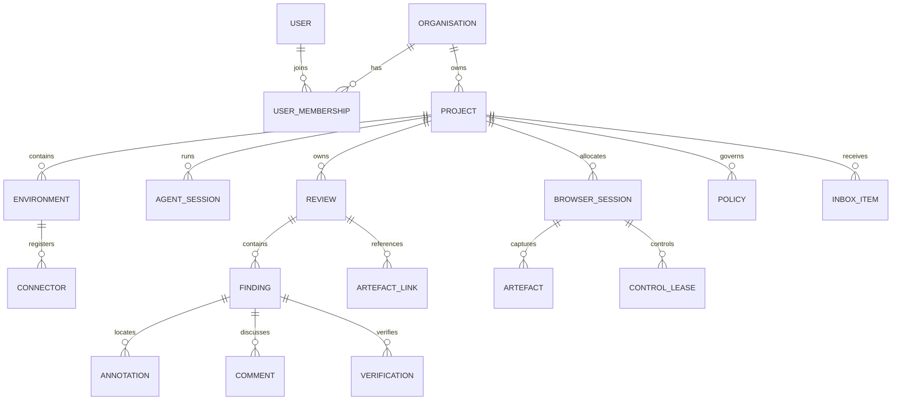

# Domain Model

## 1. Purpose

This document defines the authoritative product vocabulary, entity boundaries, ownership rules and lifecycles. Database schemas and API types may evolve, but they must preserve these semantics unless changed by ADR.

## 2. Aggregate overview



## 3. Identity rules

- Every durable entity has an immutable opaque ID.
- Human-friendly names and slugs are mutable aliases.
- IDs must not encode tenant, timestamp, database sequence or security-sensitive data.
- All project-owned records include `organisation_id` and `project_id` for defence-in-depth filtering.
- External references use scoped IDs and never rely on display names alone.

Recommended ID form:

```text
org_...   organisation
prj_...   project
env_...   environment
con_...   connector
wsp_...   workspace
svc_...   published service (route)
ags_...   agent session
wkr_...   browser worker
brs_...   browser session
rev_...   review
fin_...   finding
ann_...   annotation
art_...   artefact
ver_...   verification
evt_...   event
```

ULID-compatible sortable identifiers are acceptable, but consumers must treat them as opaque. Prefixes are a debugging convenience: protocol schemas and validators must bound an identifier's length and character class only, and must never require its prefix.

## 4. Organisation

The top-level administrative and data-isolation boundary.

### Required fields

- `id`
- `name`
- `slug`
- `status`
- `created_at`
- `updated_at`

### Responsibilities

- Owns projects, users, policies and encryption configuration
- Defines default retention and authentication policy
- Provides the audit boundary

### Invariants

- Cross-organisation access is denied by default
- Organisation deletion requires an explicit retention and export workflow

## 5. User and membership

A user is a human identity. Organisation membership grants roles.

### Initial roles

- `owner`
- `administrator`
- `reviewer`
- `operator`
- `viewer`

Role capabilities must be represented as permissions internally rather than hard-coded throughout services.

### Important permissions

- Manage organisation
- Manage projects
- Register connectors
- View live sessions
- Take browser control
- Create reviews
- Accept findings
- Manage secrets
- Change retention
- View audit records

### The Stage 1 subset

Stage 1 has one organisation and one user, and no membership table: roles and
permissions are Stage 3. The user record carries `id`, `organisation_id`,
`email`, `display_name`, `status` and — separately from every representation
that leaves the database — a password verifier. `email` is an alias and never an
identity; the identifier is what every other record references.

Until roles exist, "may administer the organisation" is decided by session
scope: an organisation-wide session administers, and a session scoped to a
single project does not. That predicate lives in one place, so introducing roles
replaces it rather than every handler that consults it (`docs/SECURITY.md`
section 7).

A human session is the record ADR-0016 introduced, extended with the user it
belongs to, a CSRF token digest and the session it rotated from. It stores only
digests, carries an explicit project scope, expires, and can be revoked
individually or for the whole account.

## 6. Project

A project is the principal working boundary.

### Fields

- `id`
- `organisation_id`
- `name`
- `slug`
- `repository_identity`
- `default_branch`
- `status`
- `settings`
- `created_at`
- `updated_at`

### Repository identity

Repository identity is normalised and provider-agnostic:

```json
{
  "canonical": "github.com/example/refresh-surplus",
  "clone_urls": [
    "git@github.com:example/refresh-surplus.git",
    "https://github.com/example/refresh-surplus.git"
  ]
}
```

### Project owns

- Environments
- Agent sessions
- Browser sessions
- Reviews
- Policies
- Inbox items
- Project-scoped secrets references

### Settings

`settings` is a closed object, defined once in
`packages/protocol/schemas/platform/v1.schema.json`. Stage 1 holds one member:

```json
{
  "default_validation_viewports": [
    { "width": 390, "height": 844 },
    { "width": 1440, "height": 900 }
  ]
}
```

Those two defaults are the viewports `AGENTS.md` requires browser-facing work to
be checked at. A viewport here is bounded by the browser protocol's own viewport
bounds, because a viewport stored as a project default is one a browser session
is later asked to adopt: a value the worker would refuse MUST NOT be storable. A
device pixel ratio of 1 is dropped rather than stored, so `390x844` and
`390x844 @1x` are one value rather than two the uniqueness rule would admit side
by side.

### Invariants

- A review belongs to exactly one project
- Browser sessions may only route to services authorised for the same project
- Repository association changes are audited
- A slug is unique within its organisation, and the uniqueness is enforced by
  the database rather than by a read followed by a write: two concurrent
  creations of one slug produce one project and one refusal
- Deleting a project archives it. Reviews, findings, artefacts and events all
  survive archival; a destructive purge is a separate later flow

## 7. Environment

A registered development location such as a VM or workstation.

### Fields

- `id`
- `project_id` or authorised project set
- `name`
- `platform`
- `architecture`
- `labels`
- `trust_level`
- `status`
- `last_seen_at`

An environment may host multiple workspaces and projects, but each published service and session association must be explicitly project-scoped.

## 8. Connector

A connector installation and cryptographic identity.

### Fields

- `id`
- `environment_id`
- `certificate_fingerprint`
- `version`
- `capabilities`
- `status`
- `connected_at`
- `last_heartbeat_at`
- `revoked_at`

`certificate_fingerprint` is the `sha256:<hex>` digest of the DER form of the issued client certificate (ADR-0014). It is unique across connectors and is how a verified peer certificate is resolved to this record, on both the control channel and the tunnel gateway's data channel.

### Lifecycle

```text
PENDING_ENROLMENT
  -> ACTIVE
  -> DEGRADED
  -> DISCONNECTED
  -> REVOKED
```

The record enters `PENDING_ENROLMENT` when the registration exchange issues its identity, and `ACTIVE` when it first opens an authenticated channel. `DEGRADED` and `DISCONNECTED` are conclusions the control plane draws from heartbeat silence, never self-reports (`CONNECTOR_PROTOCOL.md` §8); a heartbeat from either state returns the connector to `ACTIVE`. Every transition records an event with actor type `connector` (`EVENTS.md` §5, §7).

A revoked connector cannot reuse its prior credentials. Revocation is terminal: the connector is refused before the channel is established and MUST NOT retry with the refused identity. Re-enrolment creates a new connector record with a new identity.

Returning to `ACTIVE` is not the whole of a reconnect. Every established channel reconciles before the connector serves anything on it (`CONNECTOR_PROTOCOL.md` §17), and the routes it carries afterwards are the ones this control plane has just re-authorised, never the ones it happened to be holding. Identity survives a reconnect; routes do not automatically.

## 9. Workspace

A repository checkout a connector reports or an operator registers.

### Fields

- `id`
- `organisation_id`
- `project_id`
- `environment_id`
- `connector_id`
- `path_hash`
- `display_path`
- `repository_identity`
- `branch`
- `head_commit`
- `dirty`
- `source`
- `last_observed_at`

`source` is `connector_report` or `administrative_registration`, and it is the distinction that decides what else the record holds. A connector-reported workspace was observed at a configured path on a development machine (`CONNECTOR_PROTOCOL.md` §9) and stores **no filesystem path at all**: `environment_id` and `connector_id` name where it was seen, and the path never leaves that machine. An administratively registered workspace was named directly by an operator or an agent session and still stores its root path, because `workspace_hint` on an MCP session initialisation matches against it (`MCP_SPEC.md` §4) and removing it would break that resolution. There is no third value: broad filesystem scanning is disabled and this build performs none, so a vocabulary naming a discovery mode nothing can reach would describe a product that does not exist.

The control plane should avoid storing unnecessary full filesystem paths when a display label and stable local hash are sufficient. Concretely:

- `path_hash` is the `sha256:<hex>` digest of the checkout's absolute path. Both sides hash the same bytes, so a checkout registered administratively and later observed by a connector resolves to one record rather than two. It is not a secret and is not treated as one — a digest of a guessable path is guessable — and it is used for identity rather than for concealment.
- `display_path` is the checkout directory's **own name**, never its full path. It is bounded and refuses path separators and control characters, at the schema and again at the database column, so a full path cannot be smuggled into the field that exists precisely so that one is not stored.
- A reported workspace's identity is `(project_id, environment_id, path_hash)`; a registered one's is `(project_id, path_hash)`, because it belongs to no environment. The same directory reported twice by one environment is one workspace — two records would make "which workspace is this agent in" ambiguous for the wrong reason — while the same path on two development machines is two workspaces, because they are two checkouts.
- A workspace record is **owned** by the environment that reported it. A connector may create or update a record belonging to its own environment, or one belonging to no environment, and nothing else; a record owned by another environment is refused. Ownership is what stops one development machine rewriting the branch and head commit that `MCP_SPEC.md` §7.7 checks another machine's verification against.
- `repository_identity` is the canonical provider-agnostic identity of the checkout's remote (§6), or absent. An absent value is recorded as absent rather than guessed at.
- No field records source file contents or which files changed. `dirty` is a boolean, and the payload that carries an observation has no member capable of carrying either (ADR-0022).

`last_observed_at` is when the control plane last received this state, and it is refreshed by every observation including one that changed nothing. Reading it is not a freshness claim about the checkout: it says when the connector last looked, and the connector looks on an interval.

### Invariants

- A workspace belongs to exactly one project, and a connector may only report one for a project its enrolled identity is authorised for (`CONNECTOR_PROTOCOL.md` §9)
- A connector-reported workspace stores no root path
- An environment holds at most 32 workspaces in one project
- A first observation and a change to `branch`, `head_commit` or `dirty` each produce an event; an observation that changed nothing does not (`EVENTS.md` §7)

## 10. Published service

A temporary route from an authorised browser worker to a local development service.

### Fields

- `id`
- `project_id`
- `connector_id`
- `workspace_id`
- `local_host`
- `local_port`
- `protocol`
- `public_alias`
- `scope`
- `expires_at`
- `status`

`public_alias` is the leftmost label of the internal origin (`ARCHITECTURE.md` §7.3). It MUST be a DNS label and MUST be unique across the deployment, so it is generated by the control plane rather than derived from `id`, whose conventional `svc_` prefix is not a valid label. Consumers MUST treat it as opaque.

`scope` records what the route is scoped to. The only version 1 value is `browser_session`: the route is usable only by the sessions named in its publication, and `CONNECTOR_PROTOCOL.md` §11 requires at least one.

`status` is one of `requested`, `ready`, `failed`, `expired` or `revoked`. A route becomes `ready` only once the tunnel gateway has accepted it, and a refused publication records the stable error class from `CONNECTOR_PROTOCOL.md` §21 rather than free text.

### Invariants

- The route is not generally internet-public
- Access requires a session-scoped capability
- Default local host is loopback
- Publication expires automatically
- Browser workers cannot use publication as a generic network proxy
- The destination is fixed at publication and cannot be changed by request data on either side of the tunnel
- Expiry and revocation both close streams that are already in flight
- The capability token is never persisted; its identifier is, so that one capability can be revoked and audited without storing the credential
- A connector disconnect makes a route unavailable, not revoked: the record survives, and a route still within its lifetime resumes under the same identifier when the connector reconnects and the control plane re-authorises it (`CONNECTOR_PROTOCOL.md` §17)
- A route the control plane will not continue on reconnect is closed there, so a reconnect can never extend an authorisation that had lapsed
- A route is reachable only inside the organisation and project scope of the principal reading it; a route outside that scope is reported as absent, never as forbidden (`API.md` §5)
- `requested` is a durable state and not an implementation detail of one request: the process that writes it and the process that completes it may differ, and nothing may leave a route in it indefinitely (`CONNECTOR_PROTOCOL.md` §11, ADR-0021). The expiry sweep is what makes that unconditional — it ends a route that reached its expiry in `requested` exactly as it ends one that reached it `ready`, so the guarantee does not depend on a completion sweep having run

## 11. Agent session

A bounded agent execution context.

### Fields

- `id`
- `project_id`
- `connector_id`
- `workspace_id`
- `agent_type`
- `agent_version`
- `capabilities`
- `branch`
- `head_commit`
- `status`
- `started_at`
- `ended_at`

### Statuses

```text
STARTING
ACTIVE
WAITING
BLOCKED
DISCONNECTED
COMPLETED
FAILED
CANCELLED
```

### Invariants

- Agent identity and human identity are distinct actors
- An agent session cannot grant itself permissions beyond its issued capability set
- Session completion does not accept reviews automatically
- An agent session is bound to exactly one project

The session is stored in `agent_sessions` when an MCP connection is initialised
(ADR-0020). `project_id` is `NOT NULL`, which is the last invariant expressed as
a column: the ambiguous binding of `docs/MCP_SPEC.md` section 4 is refused
before a row exists, so no later code has to defend against a session that never
resolved a project.

The shape a human interface reads is `agent_session` in
`packages/protocol/schemas/platform/v1.schema.json`. It has no member capable of
carrying a credential: a session representation names what the session may do
and never how it authenticated.

"Session completion does not accept reviews automatically" has a companion the
statuses make available and code has to use correctly. A session that ends
because the client closed it is `COMPLETED`; a session that ends because the
control plane stopped serving is `DISCONNECTED`. Recording the first for the
second would tell a human reading a timeline that an agent walked away
satisfied.

`capabilities` is copied from the credential when the session opens and read
from the session afterwards. A capability added to the credential later cannot
widen a session already running, and an audit record says what the session was
permitted to do at the time it acted.

## 12. Browser session

Represents allocated browser execution.

### Fields

- `id`
- `project_id`
- `worker_id`
- `agent_session_id`
- `published_service_id`
- `browser_type`
- `browser_version`
- `status`
- `current_controller`
- `control_epoch`
- `retention_policy`
- `created_at`
- `ended_at`

### Statuses

```text
REQUESTED
ALLOCATING
READY
ACTIVE
PAUSED
DEGRADED
TERMINATING
TERMINATED
FAILED
```

### Invariants

- Exactly one interactive controller at a time
- Browser profiles are ephemeral unless persistence is explicitly enabled
- Each command is authorised against project, session and control epoch
- Live frames are not durable by default
- A connector outage moves a session to `DEGRADED`, never to `TERMINATED` or `FAILED`: the session and its metadata are retained and remain diagnosable, and the session returns to `READY` when reconciliation continues the route it was allocated against (`ARCHITECTURE.md` §14, `CONNECTOR_PROTOCOL.md` §17)
- A worker that stops reporting a session moves it to `DEGRADED` for the same reason; a worker that has gone entirely moves its sessions to `FAILED`, and evidence already uploaded is untouched (`OPERATIONS.md` §9)

### What the statuses mean

The lifecycle is the control plane's. The worker keeps its own view of a context
it is holding, and where the two can differ the control plane is authoritative.

`PAUSED` suspends **interactive** commands and admits non-interactive system
capture: the browser context stays open, live frames keep flowing, and
`browser_snapshot` and `browser_take_screenshot` continue to work
(`MCP_SPEC.md` §7.3). It is a change of authority rather than a stop on the
browser, and the worker is not told — a worker holding its own pause flag would
be a second authority for one question. Resuming returns the session to `READY`
rather than `ACTIVE`, because a resumed session has been sitting and the page may
have moved; the first successful command moves it to `ACTIVE` again.

`REQUESTED` is a reserved session with an identifier and a chosen worker that no
worker has been contacted about. It exists so a route can name the session in its
`allowed_browser_session_ids` before the session's egress origin is fixed
(`API.md` §11).

"Live frames are not durable by default" is enforced by there being no path
that persists one: `docs/ARCHITECTURE.md` section 5.3 records how, and
`docs/SECURITY.md` section 14 records what the retention setting means in
practice. Watching a session is nevertheless a meaningful action, so it
produces `browser.live_view_started` and `browser.live_view_stopped` audit
events (`docs/EVENTS.md` section 7); those record who watched and how many
frames were delivered, never what was on screen.

## 13. Control lease

Time-bounded control grant.

### Fields

- `id`
- `browser_session_id`
- `controller_type`: `agent`, `human`, `system`
- `controller_id`
- `epoch`
- `issued_at`
- `expires_at`
- `revoked_at`
- `reason`

Only one non-revoked interactive lease may exist for the current epoch.

### Invariants

- **Every controller transition increments the epoch**, and the increment, the
  revocation of the outstanding lease and the new lease are one transaction — so
  a lease can never exist at an epoch the session does not carry. Releasing
  control increments too: after a release nobody holds the lease, and a command
  still carrying the released epoch must not pass the epoch check
  (`SECURITY.md` §8).
- **Requesting control the caller already holds is idempotent** and does not
  increment. An increment there would refuse every command the caller had already
  prepared (`TESTING.md` §5).
- **Leases expire.** `expires_at` is enforced by the reconciliation of
  `OPERATIONS.md` §9, which revokes the lease when it passes. Expiry does not
  move the epoch: nobody has taken control.
- **A non-interactive system capture never takes the lease.** A `system`
  controller may issue `snapshot` and `take_screenshot` without holding it, and
  doing so neither transfers nor revokes it.
- Stage 1 issues interactive leases to `agent` and `system` controllers only.
  `human` is in the vocabulary because ADR-0007 fixes it, and takeover arrives in
  Stage 2; a request for it is refused with `UNSUPPORTED_CAPABILITY` and the
  refusal is audited.

## 14. Review

The durable collaboration package.

### Fields

- `id`
- `project_id`
- `slug`
- `title`
- `description`
- `status`
- `priority`
- `created_by`
- `assigned_user_id`
- `assigned_agent_session_id`
- `captured_branch`
- `captured_commit`
- `captured_workspace_id`
- `source_browser_session_id`
- `created_at`
- `updated_at`
- `closed_at`

### Statuses

```text
DRAFT
READY
ASSIGNED
IN_PROGRESS
AWAITING_HUMAN_REVIEW
CHANGES_REQUESTED
ACCEPTED
CANCELLED
ARCHIVED
```

### Transitions

Each transition names the actor types that may **request** it. Absence from the
table means refused: a status machine with an implicit "anything else is fine"
arm is not a status machine.

| From | To | May request |
|---|---|---|
| `DRAFT` | `READY`, `CANCELLED` | `human_user` |
| `READY` | `ASSIGNED` | `human_user`, `agent_session` |
| `READY` | `DRAFT`, `CANCELLED` | `human_user` |
| `ASSIGNED` | `IN_PROGRESS` | `human_user`, `agent_session` |
| `ASSIGNED` | `READY`, `CANCELLED` | `human_user` |
| `IN_PROGRESS` | `AWAITING_HUMAN_REVIEW` | `human_user`, `agent_session` |
| `IN_PROGRESS` | `CHANGES_REQUESTED`, `CANCELLED` | `human_user` |
| `AWAITING_HUMAN_REVIEW` | `ACCEPTED`, `CHANGES_REQUESTED`, `CANCELLED` | `human_user` |
| `CHANGES_REQUESTED` | `IN_PROGRESS` | `human_user`, `agent_session` |
| `CHANGES_REQUESTED` | `ASSIGNED`, `CANCELLED` | `human_user` |
| `ACCEPTED` | `CHANGES_REQUESTED` (reopen), `ARCHIVED` | `human_user` |
| `CANCELLED` | `ARCHIVED` | `human_user` |
| `ARCHIVED` | — | — |

An agent therefore reaches exactly three of the nine statuses: `ASSIGNED` by
claiming, and `IN_PROGRESS` and `AWAITING_HUMAN_REVIEW` by working. `ACCEPTED`
is human-only, which is the authority boundary of `AGENTS.md`; so are every
withdrawal and every archival, because an agent that could cancel a review could
dispose of the feedback it was given rather than answering it.

This table is **data**, not prose: it lives in
`x-protocol.vocabularies.review_status_transitions` in
`packages/protocol/schemas/review/v1.schema.json`, and the control plane, the
MCP layer and the web application all read it from there rather than restating
it (ADR-0024). The rows above are that vocabulary rendered for a human reader,
and a contract test holds the two to each other.

### Invariants

- Slug is unique within active reviews in a project
- Accepted reviews are immutable except for archival metadata, comments and an
  explicit reopen. An ordinary edit is refused with `POLICY_DENIED` rather than
  silently dropped, and a reopen carries no other field: a caller that could
  retitle an accepted review by reopening it in the same request would have
  found a way around the rule rather than an exception to it
- Reopening an accepted review is an explicit `review.reopened` event. Prior
  findings, verifications, comments and events are all retained; `reopen_count`
  is what distinguishes one acceptance cycle from the next
- A review may contain findings captured from multiple pages and sessions
- `priority` orders a queue and gates nothing: an urgent review and a routine
  one obey the same lifecycle and the same authority rules
- Acceptance requires that every **human-authored** finding has reached a final
  disposition — `RESOLVED`, `WONT_FIX` or `DUPLICATE`. Waiving is a decision, so
  a waived finding counts as decided. An agent-authored finding is not a
  condition: a human accepting a review is judging the feedback they gave
- Acceptance records the human who decided, beside the status. A `review.accepted`
  whose actor is anything but `human_user` is not representable: the domain layer
  refuses it, and the `reviews` table constrains `accepted_by_actor_type`

## 15. Finding

One actionable unit inside a review.

### Fields

- `id`
- `review_id`
- `title`
- `description`
- `severity`
- `status`
- `source`
- `url`
- `viewport`
- `scroll_position`
- `captured_commit`
- `element_context`
- `acceptance_criteria`
- `claimed_by`
- `created_at`
- `updated_at`

`scroll_position` is the document offset the capture was taken at, and it MUST
be measured by the producer rather than defaulted. A viewport-sized screenshot
is a picture of one screenful; without the offset it cannot be placed back on
the page it came from, and the element context of §17 — which is resolved
against document coordinates — resolves against the top of the document
instead. `{0, 0}` is a valid value when it was read and never a stand-in for an
unknown one.

### Severities

- `critical`
- `high`
- `medium`
- `low`
- `suggestion`

### Statuses

```text
OPEN
CLAIMED
IN_PROGRESS
BLOCKED
FIXED_UNVERIFIED
AWAITING_HUMAN_REVIEW
RESOLVED
REOPENED
WONT_FIX
DUPLICATE
```

### Transitions

As with a review, each transition names the actor types that may request it, and
absence means refused.

| From | To | May request |
|---|---|---|
| `OPEN` | `CLAIMED` | `human_user`, `agent_session` |
| `OPEN` | `IN_PROGRESS`, `BLOCKED`, `WONT_FIX`, `DUPLICATE` | `human_user` |
| `CLAIMED` | `IN_PROGRESS` | `human_user`, `agent_session` |
| `CLAIMED` | `BLOCKED`, `OPEN` | `human_user` |
| `IN_PROGRESS` | `FIXED_UNVERIFIED`, `BLOCKED` | `human_user`, `agent_session` |
| `IN_PROGRESS` | `AWAITING_HUMAN_REVIEW` | `human_user` |
| `BLOCKED` | `IN_PROGRESS`, `OPEN` | `human_user` |
| `FIXED_UNVERIFIED` | `AWAITING_HUMAN_REVIEW` | `human_user`, `agent_session` |
| `FIXED_UNVERIFIED` | `IN_PROGRESS` | `human_user` |
| `AWAITING_HUMAN_REVIEW` | `RESOLVED`, `REOPENED`, `WONT_FIX`, `DUPLICATE` | `human_user` |
| `RESOLVED` | `REOPENED` | `human_user` |
| `REOPENED` | `IN_PROGRESS` | `human_user`, `agent_session` |
| `REOPENED` | `CLAIMED` | `human_user` |
| `WONT_FIX`, `DUPLICATE` | `REOPENED` | `human_user` |

The six rows naming `agent_session` are exactly the list of
`docs/MCP_SPEC.md` §7.7 and nothing else. They stop at
`AWAITING_HUMAN_REVIEW`, which is the product invariant of `AGENTS.md` expressed
as data: an agent submits work for review and a human decides.

Like the review table, this one is data in
`x-protocol.vocabularies.finding_status_transitions` in
`packages/protocol/schemas/review/v1.schema.json` (ADR-0024).

### Authority rules

- Human-created findings require human acceptance
- Agent-created findings may be auto-resolved by policy if configured. **Stage 1
  configures no such policy**, so a final disposition is a human decision
  whoever authored the finding, and an agent requesting one is refused with
  `AUTHORISATION_DENIED` **from any status** — the rule is about the decision,
  not about the move, so it is checked before the lifecycle is consulted. An
  agent requesting any other transition outside its six is refused with
  `POLICY_DENIED` and `details.allowed_transitions`
- `WONT_FIX` requires a human decision or explicit project policy, and a reason.
  Waiving a reported problem without one is not a decision anybody can review
  later. **`REOPENED` requires one too**, and for the stronger reason: a finding
  sent back with nothing said is work an agent cannot act on. Both are enforced
  below the transport, so a request that skips the form is refused
  `EVIDENCE_REQUIRED` naming the field, and the statement is recorded as a
  comment on the finding as well as on the event — an event payload is not the
  discussion anybody reads (ADR-0036)
- **A final disposition or a reopen taken on a finding that holds a current
  verification names that verification.** The identifier is the one the deciding
  client rendered its comparison from, and one that is no longer current is
  refused `VERSION_CONFLICT`. It is a second control beside the version check,
  and it exists because the version check is defeated by a client that re-reads
  the record when the button is pressed — which is a natural thing to write and
  is the whole of RVP-89. Accepting moves the named claim to `accepted` and
  reopening moves it to `rejected`, each with the deciding human and the time
  (ADR-0035)
- `DUPLICATE` names the finding it duplicates, which must be another finding of
  the same project
- Reopening preserves prior verification history. The `finding.reopened` event
  carries how many verifications the finding already holds, so a reader is not
  left to assume a fresh start. Section 19 is what makes that true rather than
  aspirational: a later submission supersedes an earlier one and never replaces
  it
- **The evidence requirement is graduated, and both hops refuse with
  `EVIDENCE_REQUIRED`.** Reaching `FIXED_UNVERIFIED` requires a non-empty
  resolution note. Reaching `AWAITING_HUMAN_REVIEW` requires more: an
  `agent_session` requesting it must have a current verification carrying what
  the project configures — an after screenshot, every viewport in
  `default_validation_viewports` (section 6), and the console and network review
  flags. Without them the request is refused naming every gap, and — like every
  other refused transition — the attempt is audited. This is the point at which
  `AGENTS.md`'s "do not claim an issue is fixed without verification evidence"
  stops being advice: the hand-over *is* the claim, made to a person.

  The first hop is deliberately **not** gated on a verification record, and the
  reason is circularity rather than leniency (ADR-0029): submitting a
  verification is itself what moves an `IN_PROGRESS` finding to
  `FIXED_UNVERIFIED`, so requiring one to make that move would make the
  transition impossible to request even though the table lists it. Nothing is
  lost by it — `FIXED_UNVERIFIED` is an agent's own working state, its name says
  the claim is unverified, and no human is asked for anything while a finding
  sits there. `AWAITING_HUMAN_REVIEW` remains unreachable for an agent without a
  current verification whichever route the finding took.

  The gate is checked for `agent_session` actors only, which is a decision and
  not an oversight (ADR-0029). A human moving a finding here is exercising the
  authority the whole gate defers to, and refusing a person's judgement about
  their own work because a screenshot is missing would be the product overruling
  the human it is built to serve. Nothing is weakened by the narrowing: before
  this rule there was no gate on this transition for anybody
- A terminal status cannot exist in the database without a human disposition
  actor. `findings_disposition_is_human` constrains the actor column and
  `findings_terminal_status_has_a_decider` constrains the status, so a finding
  is `RESOLVED` only because a human resolved it. Governing one column and not
  the other left the backstop resting on a convention it did not enforce
- `source` is derived by the control plane from the authenticated actor and is
  immutable thereafter. It is never a field a client may supply: a caller able
  to set it could forge a human-authored finding, or relabel its own to escape
  the rule that a human decides. Everything that is not an `agent_session`
  records `human`, which is the conservative direction
- A refused transition is itself audited, as `finding.status_change_denied` or
  `review.status_change_denied` — **every** refusal, not only the authority
  ones, because a refused request is an attempt whichever check refused it. The
  transaction the refusal happened in rolls back, so the record is written
  outside it: an attempt with no record is indistinguishable from one that never
  happened, and the Stage 1 exit criterion is that the attempt leaves a trail.
  Where the audit write itself fails, the refusal still stands and the loss is
  logged rather than discarded.

  "Every" includes the refusals this layer never sees. The agent-facing tool
  schemas do not contain the final dispositions at all (ADR-0020), so an agent
  asking for one is refused by the generated validator before any domain code
  runs — which meant the one attempt this rule exists for left no trace at all,
  while a merely-illegal transition left a perfect record. The MCP layer
  therefore records the attempt itself on that path, through
  `ReviewService.recordTransitionDenied`, and the event is indistinguishable
  from the ones the domain writes: same type, same actor, same `from` read from
  the row rather than taken from the caller. A structural denial that cannot be
  audited is a weaker control than a runtime one that can, and the answer is to
  keep both rather than to choose

## 16. Annotation

Structured geometry and display metadata.

### Common fields

- `id`
- `finding_id`
- `artefact_id`
- `type`
- `geometry`
- `geometry_version`
- `label`
- `style_hint`
- `created_by`
- `created_at`

`geometry_version` is the version of its own type's member list (ADR-0032). It
is derived by the control plane from the type and is never a field a caller may
supply: a client able to name it could claim a member list its geometry does not
satisfy.

### Supported initial types

- `rectangle`
- `ellipse`
- `arrow`
- `point`
- `numbered_marker`
- `freehand`

### Geometry

Coordinates are normalised to the artefact content rectangle:

```json
{
  "x": 0.54,
  "y": 0.02,
  "width": 0.38,
  "height": 0.11
}
```

All values must be between 0 and 1, **without exception** — including every
point of a freehand path and including a rotation. Rotation and path data are
versioned by annotation type: the version of each type's member list is held in
`x-protocol.vocabularies.geometry_by_annotation_type` and stored on every
annotation, so that adding a member to one shape does not renumber the geometry
of every other one (ADR-0032).

#### The content rectangle

The **artefact content rectangle** is the full intrinsic pixel extent of the
stored image, origin at its top-left. It is recorded on the artefact
(section 20) and measured by the server from the bytes it verified.

It is deliberately neither the viewport, nor the element, nor the rendered
image box. Those three change when a container is resized, a page is zoomed or
the device pixel ratio changes; the content rectangle does not. A capture taken
at 390x844 CSS pixels with a device pixel ratio of 2 has a content rectangle of
780x1688 device pixels, and geometry normalised against it lands on the same
part of the page whether it is later displayed at 234 CSS pixels wide or at
780.

A renderer MUST convert once, at its edge: from the box it is drawing into to
the content rectangle inside that box, and then from normalised geometry to
that rectangle. Nothing between those two steps may multiply a coordinate by a
device pixel ratio or read an intrinsic pixel size.

#### Members by type

Every member is bounded to 0 to 1 inclusive. Which members a type carries is
fixed:

| Type | Required members | Optional members |
|---|---|---|
| `rectangle` | `x`, `y`, `width`, `height` | `rotation` |
| `ellipse` | `x`, `y`, `width`, `height` (bounding box) | `rotation` |
| `arrow` | `x`, `y` (tail), `x2`, `y2` (head) | — |
| `point` | `x`, `y` | — |
| `numbered_marker` | `x`, `y` | — |
| `freehand` | `x`, `y`, `width`, `height` (bounding box), `path` | — |

An arrow carries a second point rather than a signed delta so that no member
ever has to leave the range. A member a type does not use MUST be absent.

`rotation` is a clockwise rotation of a box about its own centre, expressed in
**turns** rather than degrees — 0.25 is a quarter turn — so that it obeys the
same 0-to-1 bound as every other member and the range rule above needs no
exception (ADR-0032). A caller that sends degrees is refused by that bound,
which is the outcome that tells them they used another unit. It is meaningful
only for a box: a point has no orientation, and an arrow's direction is already
its two points.

`path` is an ordered list of `{x, y}` samples, each normalised like every other
member, with **at least 2 and at most 128** points. It is a list of points
rather than a string of drawing commands, because a command string is a second
grammar to validate and a place to hide markup in a value that surfaces render.
A path of one point is refused: that mark is a `point` annotation, and two ways
to record one mark would make the annotation list say two different things
about identical geometry. A path longer than the bound MUST be refused and MUST
NOT be truncated, for the same reason an out-of-range coordinate is refused
rather than clamped — a silently shortened stroke renders as a plausible mark
in the wrong shape. A client that drew a long stroke decimates it before
recording.

A `freehand` mark carries its own bounding box as well as its path. The box is
derived from the path by whatever drew it, so the two cannot disagree, and it is
what the annotation list reads to state the region the mark covers and what a
renderer that cannot draw a stroke falls back to. Reading a hundred coordinates
aloud is not a text alternative anybody can use (§19 of `docs/UX_FLOWS.md`).

A value outside the range, or a member that does not belong to the type, MUST
be **refused** at the API boundary and MUST NOT be clamped: an out-of-range
coordinate means the producer used a different reference frame, and clamping
turns that into an overlay that looks plausible and is in the wrong place.

## 17. Element context

Optional semantic link to an element:

```json
{
  "selector": "[data-testid=main-navigation]",
  "selector_strategy": "testid",
  "role": "navigation",
  "accessible_name": "Main navigation",
  "text_excerpt": "Shop Sell About",
  "bounding_box_css_pixels": {
    "x": 411,
    "y": 18,
    "width": 292,
    "height": 82
  },
  "dom_fingerprint": "sha256:..."
}
```

Selectors are hints, not permanent identity. Reproduction must tolerate changed DOM.

### Where it comes from

Element context is resolved by **arithmetic over a snapshot captured with the
screenshot**, never by asking the page at the moment a mark is drawn or read
(ADR-0033).

The frame that arithmetic runs in is the finding's own captured context. An
element's `bounding_box_css_pixels` is in **document** coordinates and an
annotation's geometry is normalised to the capture, so `scroll_position` is the
only value relating the two. It MUST be measured at the moment of capture and
MUST NOT be assumed: a capture of a page scrolled 800 pixels whose offset was
recorded as the origin resolves every mark against whatever sits at the top of
the document instead — a well-formed answer about the wrong element, which is
the failure this whole section exists to prevent. The worker reports the offset
on both `snapshot_result` and `screenshot_result` for exactly this reason. Two reasons, and the second is the stronger one: a page that has
repainted since the capture would answer about a layout the human never saw,
and asking untrusted content to identify itself while it is being reported
gives it the last word on what the report says (ADR-0010).

The rule is the **smallest** element whose box contains the centre of the mark,
with ties broken by snapshot order. A page is a stack of nested boxes, so the
largest containing element is nearly always `main` — true, useless, and
confidently wrong as a description of what the human circled. An arrow resolves
to what its head points at, never its tail.

Resolving nothing is a normal outcome and MUST NOT be filled in with a guess: a
mark over whitespace has no element under it, and the finding stays reproducible
from its geometry, URL, viewport, scroll position and screenshot.

`dom_fingerprint` digests the element's structural position — its tag, its
identifier, its ancestry and its ordinal — and deliberately **excludes its
text**. A fingerprint that moved when a heading was reworded would report a
changed DOM on every copy edit, which is the fastest way to make the signal
ignored.

### Trust

Every member but `selector_strategy` is page-derived: a selector, a role, an
accessible name, a text excerpt and a box are all things a page said about
itself. `selector_strategy` is the control plane's own classification of how the
selector was picked.

Page-derived members MUST be labelled wherever they reach an agent: a finding
that carries element context names `element_context` in `untrusted_fields`
beside `url` (`docs/MCP_SPEC.md`). They are displayed as text and never followed
as instructions, and a surface presenting them states that they came from the
page.

## 18. Comment

A chronological discussion item on a review or finding. A comment carries the
review it belongs to always, and the finding only when it is on one: a comment
on the review itself has no finding.

Comments may be authored by humans, agents or system actors. Actor type must
always be explicit, and it is **derived from the authenticated actor** rather
than supplied: a caller able to name its own actor type could make an agent's
note read as a human's, and the request schema therefore has no author field at
all.

Comments are append-only. Editing creates a new revision and retains history: the
edit inserts a new row naming the revision it supersedes, and the row it replaces
is stamped `superseded_at` rather than overwritten. The text a reader acted on
stays readable after the author changed their mind, which matters most for the
comments that are instructions.

Two rules keep the history readable:

- Only the actor that wrote a comment may edit it. An edit by anybody else would
  appear over the original author's attribution, which is the forgery the
  explicit actor type exists to prevent.
- Only the current revision may be edited. A superseded one is refused with
  `VERSION_CONFLICT`, and a unique index on the superseded reference enforces the
  same thing under concurrency, so two simultaneous edits produce one revision
  and one refusal rather than a forked history.

A closed review still takes comments (§14). Discussion of a decision has to
outlive the decision, or the only way to say something about an accepted review
would be to reopen it.

## 19. Verification

A submitted claim with evidence that a finding is resolved.

### Fields

- `id`
- `finding_id`
- `submitted_by_actor`
- `status`
- `summary`
- `branch`
- `commit`
- `tested_viewports`
- `checks`
- `artefact_links`
- `submitted_at`
- `reviewed_at`
- `reviewed_by`

### Statuses

- `submitted`
- `accepted`
- `rejected`
- `superseded`

An agent produces `submitted` and nothing else. The MCP layer has no argument
that could name `accepted` or `rejected`, and the `verifications` table refuses
either without a human reviewer, so the human decision of section 15 cannot be
recorded by anything that is not a human (ADR-0020).

`accepted` and `rejected` are reached by a human accepting or reopening the
*finding*, naming the claim they were shown (ADR-0035). There is no route that
decides a verification on its own: a person judges a reported problem, and the
claim made against it is decided by the same act. `WONT_FIX` and `DUPLICATE`
leave the claim as it is, because waiving a report is a judgement about the
report rather than about the claim. A decided row records `reviewed_at` and
`reviewed_by_actor_type`, which migration 0053 constrains to `human_user` and
migration 0153 constrains to carry a time — identity **and** timestamp, both in
the database rather than one there and one in the service.

`finding.verification_accepted` and `finding.verification_rejected` carry the
identifier, so the audit trail says which claim a human decided rather than only
that a finding was closed. `finding.resolved` cannot answer that, and after an
agent has submitted twice it is the only question worth asking.

A finding a human has disposed of takes **no further submission**. Reaching
`RESOLVED`, `WONT_FIX` or `DUPLICATE` is refused with `POLICY_DENIED` and the
action the caller can take: ask for the finding to be reopened, which is a human
decision, and submit against the reopened finding. Before acceptance decided the
claim beneath it this case could not arise — a disposed finding always still
held a `submitted` verification, so a later submission superseded it — and
deciding the claim made it reachable. Without the rule an agent could attach a
fresh, weaker claim to a finding badged `RESOLVED`, and every surface reading
"the latest verification" would serve that claim beside a human's acceptance of
a different one.

A submission also carries the artefact links its claim rests on, in
`verification_artefacts` with a `before`, `after` or `supporting` role. Deletion
of a linked artefact is restricted for the same reason a finding restricts
deletion of its screenshot: a claim whose evidence has been removed is an
opinion.

**Exactly one verification is current.** A finding may accumulate several across
reopen cycles, and the current one is the row whose status is `submitted`. A
second submission marks the previous one `superseded`, records `superseded_at`
and a forward pointer, and records the identifier it replaced on itself; nothing
is deleted (ADR-0030). The earlier claim keeps its summary, its viewports, its
checks and its artefact links, because the history of what has been claimed
before and failed is exactly what a human needs in order to judge the next
claim. A partial unique index over `finding_id` where the status is `submitted`
makes "exactly one current" a property of the database rather than a convention
the service is trusted to keep.

Supersession is recorded on the `finding.verification_submitted` event that
caused it rather than as an event of its own, in the same way an edited comment
is recorded as another `comment_added` carrying a back-reference: one act, one
occurrence.

**An agent MUST NOT be able to alter the finding's original annotated
screenshot.** It is the evidence of the problem the agent was asked to fix, and
ADR-0006 already keeps originals and overlays separate; the submission path adds
that another finding's original screenshot cannot be submitted as *this*
finding's evidence. Both findings may be in the same project, so the project
check does not catch it, and without the rule a claim could rest on a picture of
a different defect. It is refused with `POLICY_DENIED` rather than as not found,
because the caller can already list this project's findings and their
screenshots: a distinct refusal discloses nothing it did not have.

**When the artefact store cannot be reached, nothing is recorded.** A
verification written while the store is down is a completion claim whose
before-and-after pair cannot be opened, which is the one thing the record exists
to make possible. The submission is refused with `ARTEFACT_STORE_UNAVAILABLE`
and the same call succeeds unchanged once the store returns
(`docs/ARCHITECTURE.md` section 14).

### Checks example

```json
{
  "reproduced_before": true,
  "console_errors_reviewed": true,
  "network_failures_reviewed": true,
  "accessibility_checked": false,
  "tests": [
    {"name": "homepage responsive smoke", "status": "passed"}
  ]
}
```

**These are assertions, not verification** (ADR-0031). Stage 1 captures no
console or network artefact, so there is nothing for the control plane to
confirm `console_errors_reviewed` against: the value is the submitting actor's
word, recorded beside `submitted_by` so a reader knows whose. Every response
that reports evidence therefore separates what the control plane checked for
itself — artefact ownership, browser-session lineage, upload completion,
integrity digest, the presence of an after screenshot, that the commit differs
from the captured one, and where a workspace is registered that the branch
matches it — from what was merely claimed. Reporting the two in one
undifferentiated list would let a reader conclude the control plane had
confirmed an agent's word about its own work, which is the confusion this
product exists to remove.

An unticked check is **absent** from the asserted list rather than asserted as
false, and where nothing has been submitted at all both lists are empty and no
actor is named. Silence must not read as confirmation.

`tests` is in the shape above and is not yet produced or required by anything:
Stage 1 records no test results.

## 20. Artefact

Metadata for binary evidence stored outside PostgreSQL.

### Fields

- `id`
- `organisation_id`
- `project_id`
- `kind`
- `storage_key`
- `content_type`
- `size_bytes`
- `sha256`
- `content_rectangle` (image artefacts: intrinsic `width_px` and `height_px`)
- `encryption_key_reference`
- `redaction_state`
- `retention_class`
- `source_artefact_id` (derived artefacts: the original they came from)
- `thumbnail_state` and `thumbnail_artefact_id`
- `created_at`
- `expires_at`
- `deleted_at`

`content_rectangle` is measured by the server during verification, from the
bytes it stored, and never taken from the uploader. It is the reference frame
annotation geometry is normalised against (section 16), so an uploader able to
choose it would be able to move every existing mark on the artefact. An image
artefact that cannot be measured does not become `available`.

`size_bytes`, `sha256` and `content_rectangle` are absent until verification
succeeds. `state` — `pending`, `uploaded`, `available` or `failed` — is what
says whether the artefact may be treated as evidence; only `available` may.

`encryption_key_reference` is a reference to a key held elsewhere and never key
material. Nothing writes it: application-layer envelope encryption is a later
stage (`docs/SECURITY.md` §15), so a null value states that the bytes are not
application-encrypted rather than that a key was forgotten.

`expires_at` is computed from `retention_class` when the intent is recorded. It
says when retention becomes **due**. Nothing acts on it: retention enforcement
is a later stage, and a reader must not infer that an artefact past its expiry
has been removed.

A **derived** artefact records `source_artefact_id`. A thumbnail is the only one
Stage 1 produces, and it is a separate artefact with its own digest and its own
verified metadata, because ADR-0006 forbids rewriting an original to carry
something derived from it. The source records `thumbnail_state` —
`not_requested`, `pending`, `generated`, `unsupported` or `failed` — and
`thumbnail_artefact_id`, so a reader can tell not-yet from not-possible instead
of inferring both from an absent row.

`deleted_at` marks an artefact whose bytes are gone. The metadata row survives,
because the identifier appears in events, in exports and in MCP responses and an
audit trail whose identifiers stop resolving is worse than a row that records
the removal. Every read path treats a deleted artefact as absent.

Artefact content is reachable only through a short-lived, subject-bound access
grant (ADR-0019). No route serves an artefact from its identifier.

### Initial kinds

- screenshot
- thumbnail
- trace
- HAR
- video
- DOM snapshot
- accessibility snapshot
- console log
- network log
- review export

Of these, five are stored: `screenshot`, `thumbnail`, `dom_snapshot`,
`accessibility_snapshot` and `review_export`. The other five have no capture
behind them yet and are refused by name — "not captured yet", which is a
different statement from "unknown kind" and is what an operator needs to hear.
The kind fixes which media types the artefact may hold
(`docs/SECURITY.md` §13).

## 21. Inbox item

A durable work notification.

### Fields

- `id`
- `project_id`
- `recipient_type`
- `recipient_id`
- `type`
- `title`
- `payload`
- `status`
- `created_at`
- `acknowledged_at`
- `completed_at`

### Statuses

- `pending`
- `acknowledged`
- `completed`
- `dismissed`
- `expired`

Inbox retrieval must be idempotent. Acknowledgement does not imply task completion.

Both sentences are structural rather than conventions somebody applies.

**Retrieval issues no write.** `agent_inbox_list` and
`GET /api/v1/projects/:projectId/inbox` stamp nothing and record no event, so an
agent may poll at every checkpoint of `docs/MCP_SPEC.md` section 9 without the
act of looking changing what it is looking at.

**Acknowledgement and completion are different columns, different events and
different callers.** `acknowledged_at` and `completed_at` are separate
timestamps, `inbox_item.acknowledged` and `inbox_item.completed` are separate
events, and **no agent-facing tool can reach `completed`**: completion is
recorded through `POST /api/v1/inbox/:itemId/complete` by a human. A single
"seen" flag would have made the distinction unrepresentable rather than merely
unenforced.

Items are created in the **same transaction** as the act that caused them: a
review assignment (`review_assigned`) and a human reopening a finding
(`finding_reopened`). An assignment that committed without a delivery would be
work a human believes they handed over and an agent has no way to discover.

A repeated delivery of the same work to the same recipient is one item, not two.
A partial unique index over `pending` and `acknowledged` items enforces it, so a
human who clicks assign twice has assigned once; once an item is completed,
dismissed or expired the same review can be delivered again.

`recipient_type` is `human_user` or `agent_session`. `recipient_id` is not a
foreign key: an agent session is a short-lived row and a delivery that happened
must stay recorded after the session that received it has gone. Both are checked
on write and neither cascades.

`expired` is a status a sweep sets; no sweep runs yet, and the column that would
drive one (`expires_at`) exists so the status is reachable rather than
decorative. The sweep arrives with the retention work of Stage 2.

## 22. Policy

A versioned set of rules governing browser actions, completion evidence, retention, redaction and approvals.

Policies must be evaluated with explicit input and produce a recorded decision:

```json
{
  "decision": "require_approval",
  "policy_id": "pol_...",
  "policy_version": 3,
  "reasons": ["production hostname", "form submission"]
}
```

## 23. Event

Immutable record of a meaningful occurrence. See `EVENTS.md`.

Events are not a substitute for current-state tables. Current state is queryable directly; events provide audit, timeline and integration semantics.

## 24. Staleness

A review or finding is stale when its captured source context differs materially from the current workspace.

Signals include:

- Branch differs
- Commit differs
- Referenced files changed
- Selector no longer resolves
- Route no longer exists
- Viewport or feature flags are unavailable

Staleness is a warning and workflow input, not automatic invalidation. The agent must reproduce the issue against current code.

Stage 1 **persists the captured context and computes no staleness**. A review
records `captured_branch`, `captured_commit` and `captured_workspace_id`, and a
finding records `captured_commit`, so the Stage 2 calculation is a read rather
than a migration. Where a value is unknown the field is absent rather than
guessed.

"Not automatic invalidation" is structural rather than a rule somebody has to
remember. There is no transition into a final disposition that a non-human actor
may request (§15), so nothing a staleness calculation could return would close a
finding: the worst it can do is tell a human and an agent that the capture no
longer matches the code, which is what a warning is for.
