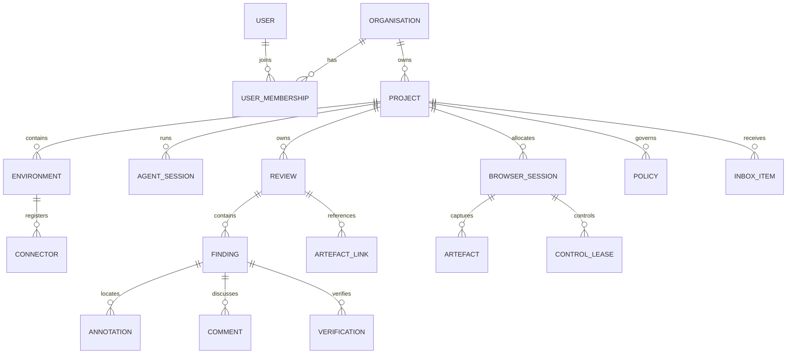

# Domain Model

## 1. Purpose

This document defines the authoritative product vocabulary, entity boundaries, ownership rules and lifecycles. Database schemas and API types may evolve, but they must preserve these semantics unless changed by ADR.

## 2. Aggregate overview



## 3. Identity rules

- Every durable entity has an immutable opaque ID.
- Human-friendly names and slugs are mutable aliases.
- IDs must not encode tenant, timestamp, database sequence or security-sensitive data.
- All project-owned records include `organisation_id` and `project_id` for defence-in-depth filtering.
- External references use scoped IDs and never rely on display names alone.

Recommended ID form:

```text
org_...   organisation
prj_...   project
env_...   environment
con_...   connector
wsp_...   workspace
svc_...   published service (route)
ags_...   agent session
wkr_...   browser worker
brs_...   browser session
rev_...   review
fin_...   finding
ann_...   annotation
art_...   artefact
ver_...   verification
evt_...   event
```

ULID-compatible sortable identifiers are acceptable, but consumers must treat them as opaque. Prefixes are a debugging convenience: protocol schemas and validators must bound an identifier's length and character class only, and must never require its prefix.

## 4. Organisation

The top-level administrative and data-isolation boundary.

### Required fields

- `id`
- `name`
- `slug`
- `status`
- `created_at`
- `updated_at`

### Responsibilities

- Owns projects, users, policies and encryption configuration
- Defines default retention and authentication policy
- Provides the audit boundary

### Invariants

- Cross-organisation access is denied by default
- Organisation deletion requires an explicit retention and export workflow

## 5. User and membership

A user is a human identity. Organisation membership grants roles.

### Initial roles

- `owner`
- `administrator`
- `reviewer`
- `operator`
- `viewer`

Role capabilities must be represented as permissions internally rather than hard-coded throughout services.

### Important permissions

- Manage organisation
- Manage projects
- Register connectors
- View live sessions
- Take browser control
- Create reviews
- Accept findings
- Manage secrets
- Change retention
- View audit records

### The Stage 1 subset

Stage 1 has one organisation and one user, and no membership table: roles and
permissions are Stage 3. The user record carries `id`, `organisation_id`,
`email`, `display_name`, `status` and — separately from every representation
that leaves the database — a password verifier. `email` is an alias and never an
identity; the identifier is what every other record references.

Until roles exist, "may administer the organisation" is decided by session
scope: an organisation-wide session administers, and a session scoped to a
single project does not. That predicate lives in one place, so introducing roles
replaces it rather than every handler that consults it (`docs/SECURITY.md`
section 7).

A human session is the record ADR-0016 introduced, extended with the user it
belongs to, a CSRF token digest and the session it rotated from. It stores only
digests, carries an explicit project scope, expires, and can be revoked
individually or for the whole account.

## 6. Project

A project is the principal working boundary.

### Fields

- `id`
- `organisation_id`
- `name`
- `slug`
- `repository_identity`
- `default_branch`
- `status`
- `settings`
- `created_at`
- `updated_at`

### Repository identity

Repository identity is normalised and provider-agnostic:

```json
{
  "canonical": "github.com/example/refresh-surplus",
  "clone_urls": [
    "git@github.com:example/refresh-surplus.git",
    "https://github.com/example/refresh-surplus.git"
  ]
}
```

### Project owns

- Environments
- Agent sessions
- Browser sessions
- Reviews
- Policies
- Inbox items
- Project-scoped secrets references

### Settings

`settings` is a closed object, defined once in
`packages/protocol/schemas/platform/v1.schema.json`. Stage 1 holds one member:

```json
{
  "default_validation_viewports": [
    { "width": 390, "height": 844 },
    { "width": 1440, "height": 900 }
  ]
}
```

Those two defaults are the viewports `AGENTS.md` requires browser-facing work to
be checked at. A viewport here is bounded by the browser protocol's own viewport
bounds, because a viewport stored as a project default is one a browser session
is later asked to adopt: a value the worker would refuse MUST NOT be storable. A
device pixel ratio of 1 is dropped rather than stored, so `390x844` and
`390x844 @1x` are one value rather than two the uniqueness rule would admit side
by side.

### Invariants

- A review belongs to exactly one project
- Browser sessions may only route to services authorised for the same project
- Repository association changes are audited
- A slug is unique within its organisation, and the uniqueness is enforced by
  the database rather than by a read followed by a write: two concurrent
  creations of one slug produce one project and one refusal
- Deleting a project archives it. Reviews, findings, artefacts and events all
  survive archival; a destructive purge is a separate later flow

## 7. Environment

A registered development location such as a VM or workstation.

### Fields

- `id`
- `project_id` or authorised project set
- `name`
- `platform`
- `architecture`
- `labels`
- `trust_level`
- `status`
- `last_seen_at`

An environment may host multiple workspaces and projects, but each published service and session association must be explicitly project-scoped.

## 8. Connector

A connector installation and cryptographic identity.

### Fields

- `id`
- `environment_id`
- `certificate_fingerprint`
- `version`
- `capabilities`
- `status`
- `connected_at`
- `last_heartbeat_at`
- `revoked_at`

`certificate_fingerprint` is the `sha256:<hex>` digest of the DER form of the issued client certificate (ADR-0014). It is unique across connectors and is how a verified peer certificate is resolved to this record, on both the control channel and the tunnel gateway's data channel.

### Lifecycle

```text
PENDING_ENROLMENT
  -> ACTIVE
  -> DEGRADED
  -> DISCONNECTED
  -> REVOKED
```

The record enters `PENDING_ENROLMENT` when the registration exchange issues its identity, and `ACTIVE` when it first opens an authenticated channel. `DEGRADED` and `DISCONNECTED` are conclusions the control plane draws from heartbeat silence, never self-reports (`CONNECTOR_PROTOCOL.md` §8); a heartbeat from either state returns the connector to `ACTIVE`. Every transition records an event with actor type `connector` (`EVENTS.md` §5, §7).

A revoked connector cannot reuse its prior credentials. Revocation is terminal: the connector is refused before the channel is established and MUST NOT retry with the refused identity. Re-enrolment creates a new connector record with a new identity.

Returning to `ACTIVE` is not the whole of a reconnect. Every established channel reconciles before the connector serves anything on it (`CONNECTOR_PROTOCOL.md` §17), and the routes it carries afterwards are the ones this control plane has just re-authorised, never the ones it happened to be holding. Identity survives a reconnect; routes do not automatically.

## 9. Workspace

A repository checkout detected by a connector.

### Fields

- `id`
- `environment_id`
- `project_id`
- `path_hash`
- `display_path`
- `repository_identity`
- `branch`
- `head_commit`
- `dirty`
- `last_observed_at`

The control plane should avoid storing unnecessary full filesystem paths when a display label and stable local hash are sufficient.

## 10. Published service

A temporary route from an authorised browser worker to a local development service.

### Fields

- `id`
- `project_id`
- `connector_id`
- `workspace_id`
- `local_host`
- `local_port`
- `protocol`
- `public_alias`
- `scope`
- `expires_at`
- `status`

`public_alias` is the leftmost label of the internal origin (`ARCHITECTURE.md` §7.3). It MUST be a DNS label and MUST be unique across the deployment, so it is generated by the control plane rather than derived from `id`, whose conventional `svc_` prefix is not a valid label. Consumers MUST treat it as opaque.

`scope` records what the route is scoped to. The only version 1 value is `browser_session`: the route is usable only by the sessions named in its publication, and `CONNECTOR_PROTOCOL.md` §11 requires at least one.

`status` is one of `requested`, `ready`, `failed`, `expired` or `revoked`. A route becomes `ready` only once the tunnel gateway has accepted it, and a refused publication records the stable error class from `CONNECTOR_PROTOCOL.md` §21 rather than free text.

### Invariants

- The route is not generally internet-public
- Access requires a session-scoped capability
- Default local host is loopback
- Publication expires automatically
- Browser workers cannot use publication as a generic network proxy
- The destination is fixed at publication and cannot be changed by request data on either side of the tunnel
- Expiry and revocation both close streams that are already in flight
- The capability token is never persisted; its identifier is, so that one capability can be revoked and audited without storing the credential
- A connector disconnect makes a route unavailable, not revoked: the record survives, and a route still within its lifetime resumes under the same identifier when the connector reconnects and the control plane re-authorises it (`CONNECTOR_PROTOCOL.md` §17)
- A route the control plane will not continue on reconnect is closed there, so a reconnect can never extend an authorisation that had lapsed

## 11. Agent session

A bounded agent execution context.

### Fields

- `id`
- `project_id`
- `connector_id`
- `workspace_id`
- `agent_type`
- `agent_version`
- `capabilities`
- `branch`
- `head_commit`
- `status`
- `started_at`
- `ended_at`

### Statuses

```text
STARTING
ACTIVE
WAITING
BLOCKED
DISCONNECTED
COMPLETED
FAILED
CANCELLED
```

### Invariants

- Agent identity and human identity are distinct actors
- An agent session cannot grant itself permissions beyond its issued capability set
- Session completion does not accept reviews automatically
- An agent session is bound to exactly one project

Stage 0 stores the session in `agent_sessions` when an MCP connection is
initialised (ADR-0020). `project_id` is `NOT NULL`, which is the last invariant
expressed as a column: the ambiguous binding of `docs/MCP_SPEC.md` section 4 is
refused before a row exists, so no later code has to defend against a session
that never resolved a project.

`capabilities` is copied from the credential when the session opens and read
from the session afterwards. A capability added to the credential later cannot
widen a session already running, and an audit record says what the session was
permitted to do at the time it acted.

## 12. Browser session

Represents allocated browser execution.

### Fields

- `id`
- `project_id`
- `worker_id`
- `agent_session_id`
- `published_service_id`
- `browser_type`
- `browser_version`
- `status`
- `current_controller`
- `control_epoch`
- `retention_policy`
- `created_at`
- `ended_at`

### Statuses

```text
REQUESTED
ALLOCATING
READY
ACTIVE
PAUSED
DEGRADED
TERMINATING
TERMINATED
FAILED
```

### Invariants

- Exactly one interactive controller at a time
- Browser profiles are ephemeral unless persistence is explicitly enabled
- Each command is authorised against project, session and control epoch
- Live frames are not durable by default
- A connector outage moves a session to `DEGRADED`, never to `TERMINATED` or `FAILED`: the session and its metadata are retained and remain diagnosable, and the session returns to `READY` when reconciliation continues the route it was allocated against (`ARCHITECTURE.md` §14, `CONNECTOR_PROTOCOL.md` §17)

"Live frames are not durable by default" is enforced by there being no path
that persists one: `docs/ARCHITECTURE.md` section 5.3 records how, and
`docs/SECURITY.md` section 14 records what the retention setting means in
practice. Watching a session is nevertheless a meaningful action, so it
produces `browser.live_view_started` and `browser.live_view_stopped` audit
events (`docs/EVENTS.md` section 7); those record who watched and how many
frames were delivered, never what was on screen.

## 13. Control lease

Time-bounded control grant.

### Fields

- `id`
- `browser_session_id`
- `controller_type`: `agent`, `human`, `system`
- `controller_id`
- `epoch`
- `issued_at`
- `expires_at`
- `revoked_at`
- `reason`

Only one non-revoked interactive lease may exist for the current epoch.

## 14. Review

The durable collaboration package.

### Fields

- `id`
- `project_id`
- `slug`
- `title`
- `description`
- `status`
- `priority`
- `created_by`
- `assigned_user_id`
- `assigned_agent_session_id`
- `captured_branch`
- `captured_commit`
- `captured_workspace_id`
- `source_browser_session_id`
- `created_at`
- `updated_at`
- `closed_at`

### Statuses

```text
DRAFT
READY
ASSIGNED
IN_PROGRESS
AWAITING_HUMAN_REVIEW
CHANGES_REQUESTED
ACCEPTED
CANCELLED
ARCHIVED
```

### Transitions

Each transition names the actor types that may **request** it. Absence from the
table means refused: a status machine with an implicit "anything else is fine"
arm is not a status machine.

| From | To | May request |
|---|---|---|
| `DRAFT` | `READY`, `CANCELLED` | `human_user` |
| `READY` | `ASSIGNED` | `human_user`, `agent_session` |
| `READY` | `DRAFT`, `CANCELLED` | `human_user` |
| `ASSIGNED` | `IN_PROGRESS` | `human_user`, `agent_session` |
| `ASSIGNED` | `READY`, `CANCELLED` | `human_user` |
| `IN_PROGRESS` | `AWAITING_HUMAN_REVIEW` | `human_user`, `agent_session` |
| `IN_PROGRESS` | `CHANGES_REQUESTED`, `CANCELLED` | `human_user` |
| `AWAITING_HUMAN_REVIEW` | `ACCEPTED`, `CHANGES_REQUESTED`, `CANCELLED` | `human_user` |
| `CHANGES_REQUESTED` | `IN_PROGRESS` | `human_user`, `agent_session` |
| `CHANGES_REQUESTED` | `ASSIGNED`, `CANCELLED` | `human_user` |
| `ACCEPTED` | `CHANGES_REQUESTED` (reopen), `ARCHIVED` | `human_user` |
| `CANCELLED` | `ARCHIVED` | `human_user` |
| `ARCHIVED` | — | — |

An agent therefore reaches exactly three of the nine statuses: `ASSIGNED` by
claiming, and `IN_PROGRESS` and `AWAITING_HUMAN_REVIEW` by working. `ACCEPTED`
is human-only, which is the authority boundary of `AGENTS.md`; so are every
withdrawal and every archival, because an agent that could cancel a review could
dispose of the feedback it was given rather than answering it.

This table is **data**, not prose: it lives in
`x-protocol.vocabularies.review_status_transitions` in
`packages/protocol/schemas/review/v1.schema.json`, and the control plane, the
MCP layer and the web application all read it from there rather than restating
it (ADR-0024). The rows above are that vocabulary rendered for a human reader,
and a contract test holds the two to each other.

### Invariants

- Slug is unique within active reviews in a project
- Accepted reviews are immutable except for archival metadata, comments and an
  explicit reopen. An ordinary edit is refused with `POLICY_DENIED` rather than
  silently dropped, and a reopen carries no other field: a caller that could
  retitle an accepted review by reopening it in the same request would have
  found a way around the rule rather than an exception to it
- Reopening an accepted review is an explicit `review.reopened` event. Prior
  findings, verifications, comments and events are all retained; `reopen_count`
  is what distinguishes one acceptance cycle from the next
- A review may contain findings captured from multiple pages and sessions
- `priority` orders a queue and gates nothing: an urgent review and a routine
  one obey the same lifecycle and the same authority rules
- Acceptance requires that every **human-authored** finding has reached a final
  disposition — `RESOLVED`, `WONT_FIX` or `DUPLICATE`. Waiving is a decision, so
  a waived finding counts as decided. An agent-authored finding is not a
  condition: a human accepting a review is judging the feedback they gave
- Acceptance records the human who decided, beside the status. A `review.accepted`
  whose actor is anything but `human_user` is not representable: the domain layer
  refuses it, and the `reviews` table constrains `accepted_by_actor_type`

## 15. Finding

One actionable unit inside a review.

### Fields

- `id`
- `review_id`
- `title`
- `description`
- `severity`
- `status`
- `source`
- `url`
- `viewport`
- `scroll_position`
- `captured_commit`
- `element_context`
- `acceptance_criteria`
- `claimed_by`
- `created_at`
- `updated_at`

### Severities

- `critical`
- `high`
- `medium`
- `low`
- `suggestion`

### Statuses

```text
OPEN
CLAIMED
IN_PROGRESS
BLOCKED
FIXED_UNVERIFIED
AWAITING_HUMAN_REVIEW
RESOLVED
REOPENED
WONT_FIX
DUPLICATE
```

### Transitions

As with a review, each transition names the actor types that may request it, and
absence means refused.

| From | To | May request |
|---|---|---|
| `OPEN` | `CLAIMED` | `human_user`, `agent_session` |
| `OPEN` | `IN_PROGRESS`, `BLOCKED`, `WONT_FIX`, `DUPLICATE` | `human_user` |
| `CLAIMED` | `IN_PROGRESS` | `human_user`, `agent_session` |
| `CLAIMED` | `BLOCKED`, `OPEN` | `human_user` |
| `IN_PROGRESS` | `FIXED_UNVERIFIED`, `BLOCKED` | `human_user`, `agent_session` |
| `IN_PROGRESS` | `AWAITING_HUMAN_REVIEW` | `human_user` |
| `BLOCKED` | `IN_PROGRESS`, `OPEN` | `human_user` |
| `FIXED_UNVERIFIED` | `AWAITING_HUMAN_REVIEW` | `human_user`, `agent_session` |
| `FIXED_UNVERIFIED` | `IN_PROGRESS` | `human_user` |
| `AWAITING_HUMAN_REVIEW` | `RESOLVED`, `REOPENED`, `WONT_FIX`, `DUPLICATE` | `human_user` |
| `RESOLVED` | `REOPENED` | `human_user` |
| `REOPENED` | `IN_PROGRESS` | `human_user`, `agent_session` |
| `REOPENED` | `CLAIMED` | `human_user` |
| `WONT_FIX`, `DUPLICATE` | `REOPENED` | `human_user` |

The six rows naming `agent_session` are exactly the list of
`docs/MCP_SPEC.md` §7.7 and nothing else. They stop at
`AWAITING_HUMAN_REVIEW`, which is the product invariant of `AGENTS.md` expressed
as data: an agent submits work for review and a human decides.

Like the review table, this one is data in
`x-protocol.vocabularies.finding_status_transitions` in
`packages/protocol/schemas/review/v1.schema.json` (ADR-0024).

### Authority rules

- Human-created findings require human acceptance
- Agent-created findings may be auto-resolved by policy if configured. **Stage 1
  configures no such policy**, so a final disposition is a human decision
  whoever authored the finding, and an agent requesting one is refused with
  `AUTHORISATION_DENIED` **from any status** — the rule is about the decision,
  not about the move, so it is checked before the lifecycle is consulted. An
  agent requesting any other transition outside its six is refused with
  `POLICY_DENIED` and `details.allowed_transitions`
- `WONT_FIX` requires a human decision or explicit project policy, and a reason.
  Waiving a reported problem without one is not a decision anybody can review
  later
- `DUPLICATE` names the finding it duplicates, which must be another finding of
  the same project
- Reopening preserves prior verification history. The `finding.reopened` event
  carries how many verifications the finding already holds, so a reader is not
  left to assume a fresh start
- `source` is derived by the control plane from the authenticated actor and is
  immutable thereafter. It is never a field a client may supply: a caller able
  to set it could forge a human-authored finding, or relabel its own to escape
  the rule that a human decides. Everything that is not an `agent_session`
  records `human`, which is the conservative direction
- A refused transition is itself audited, as `finding.status_change_denied` or
  `review.status_change_denied` — **every** refusal, not only the authority
  ones, because a refused request is an attempt whichever check refused it. The
  transaction the refusal happened in rolls back, so the record is written
  outside it: an attempt with no record is indistinguishable from one that never
  happened, and the Stage 1 exit criterion is that the attempt leaves a trail.
  Where the audit write itself fails, the refusal still stands and the loss is
  logged rather than discarded

## 16. Annotation

Structured geometry and display metadata.

### Common fields

- `id`
- `finding_id`
- `artefact_id`
- `type`
- `geometry`
- `label`
- `style_hint`
- `created_by`
- `created_at`

### Supported initial types

- `rectangle`
- `ellipse`
- `arrow`
- `point`
- `numbered_marker`
- `freehand`

### Geometry

Coordinates are normalised to the artefact content rectangle:

```json
{
  "x": 0.54,
  "y": 0.02,
  "width": 0.38,
  "height": 0.11
}
```

All values must be between 0 and 1. Rotation and path data are versioned by annotation type.

#### The content rectangle

The **artefact content rectangle** is the full intrinsic pixel extent of the
stored image, origin at its top-left. It is recorded on the artefact
(section 20) and measured by the server from the bytes it verified.

It is deliberately neither the viewport, nor the element, nor the rendered
image box. Those three change when a container is resized, a page is zoomed or
the device pixel ratio changes; the content rectangle does not. A capture taken
at 390x844 CSS pixels with a device pixel ratio of 2 has a content rectangle of
780x1688 device pixels, and geometry normalised against it lands on the same
part of the page whether it is later displayed at 234 CSS pixels wide or at
780.

A renderer MUST convert once, at its edge: from the box it is drawing into to
the content rectangle inside that box, and then from normalised geometry to
that rectangle. Nothing between those two steps may multiply a coordinate by a
device pixel ratio or read an intrinsic pixel size.

#### Members by type

Every member is bounded to 0 to 1 inclusive. Which members a type carries is
fixed:

| Type | Members |
|---|---|
| `rectangle` | `x`, `y`, `width`, `height` |
| `ellipse` | `x`, `y`, `width`, `height` (bounding box) |
| `arrow` | `x`, `y` (tail), `x2`, `y2` (head) |
| `point` | `x`, `y` |
| `numbered_marker` | `x`, `y` |

An arrow carries a second point rather than a signed delta so that no member
ever has to leave the range. A member a type does not use MUST be absent.

A value outside the range, or a member that does not belong to the type, MUST
be **refused** at the API boundary and MUST NOT be clamped: an out-of-range
coordinate means the producer used a different reference frame, and clamping
turns that into an overlay that looks plausible and is in the wrong place.

## 17. Element context

Optional semantic link to an element:

```json
{
  "selector": "[data-testid=main-navigation]",
  "selector_strategy": "testid",
  "role": "navigation",
  "accessible_name": "Main navigation",
  "text_excerpt": "Shop Sell About",
  "bounding_box_css_pixels": {
    "x": 411,
    "y": 18,
    "width": 292,
    "height": 82
  },
  "dom_fingerprint": "sha256:..."
}
```

Selectors are hints, not permanent identity. Reproduction must tolerate changed DOM.

## 18. Comment

A chronological discussion item on a review or finding. A comment carries the
review it belongs to always, and the finding only when it is on one: a comment
on the review itself has no finding.

Comments may be authored by humans, agents or system actors. Actor type must
always be explicit, and it is **derived from the authenticated actor** rather
than supplied: a caller able to name its own actor type could make an agent's
note read as a human's, and the request schema therefore has no author field at
all.

Comments are append-only. Editing creates a new revision and retains history: the
edit inserts a new row naming the revision it supersedes, and the row it replaces
is stamped `superseded_at` rather than overwritten. The text a reader acted on
stays readable after the author changed their mind, which matters most for the
comments that are instructions.

Two rules keep the history readable:

- Only the actor that wrote a comment may edit it. An edit by anybody else would
  appear over the original author's attribution, which is the forgery the
  explicit actor type exists to prevent.
- Only the current revision may be edited. A superseded one is refused with
  `VERSION_CONFLICT`, and a unique index on the superseded reference enforces the
  same thing under concurrency, so two simultaneous edits produce one revision
  and one refusal rather than a forked history.

A closed review still takes comments (§14). Discussion of a decision has to
outlive the decision, or the only way to say something about an accepted review
would be to reopen it.

## 19. Verification

A submitted claim with evidence that a finding is resolved.

### Fields

- `id`
- `finding_id`
- `submitted_by_actor`
- `status`
- `summary`
- `branch`
- `commit`
- `tested_viewports`
- `checks`
- `artefact_links`
- `submitted_at`
- `reviewed_at`
- `reviewed_by`

### Statuses

- `submitted`
- `accepted`
- `rejected`
- `superseded`

An agent produces `submitted` and nothing else. The MCP layer has no argument
that could name `accepted` or `rejected`, and the `verifications` table refuses
either without a human reviewer, so the human decision of section 15 cannot be
recorded by anything that is not a human (ADR-0020).

A submission also carries the artefact links its claim rests on, in
`verification_artefacts` with a `before`, `after` or `supporting` role. Deletion
of a linked artefact is restricted for the same reason a finding restricts
deletion of its screenshot: a claim whose evidence has been removed is an
opinion.

### Checks example

```json
{
  "reproduced_before": true,
  "console_errors_reviewed": true,
  "network_failures_reviewed": true,
  "accessibility_checked": false,
  "tests": [
    {"name": "homepage responsive smoke", "status": "passed"}
  ]
}
```

## 20. Artefact

Metadata for binary evidence stored outside PostgreSQL.

### Fields

- `id`
- `organisation_id`
- `project_id`
- `kind`
- `storage_key`
- `content_type`
- `size_bytes`
- `sha256`
- `content_rectangle` (image artefacts: intrinsic `width_px` and `height_px`)
- `encryption_key_reference`
- `redaction_state`
- `retention_class`
- `created_at`
- `expires_at`

`content_rectangle` is measured by the server during verification, from the
bytes it stored, and never taken from the uploader. It is the reference frame
annotation geometry is normalised against (section 16), so an uploader able to
choose it would be able to move every existing mark on the artefact. An image
artefact that cannot be measured does not become `available`.

`size_bytes`, `sha256` and `content_rectangle` are absent until verification
succeeds. `state` — `pending`, `uploaded`, `available` or `failed` — is what
says whether the artefact may be treated as evidence; only `available` may.

Artefact content is reachable only through a short-lived, subject-bound access
grant (ADR-0019). No route serves an artefact from its identifier.

### Initial kinds

- screenshot
- thumbnail
- trace
- HAR
- video
- DOM snapshot
- accessibility snapshot
- console log
- network log
- review export

## 21. Inbox item

A durable work notification.

### Fields

- `id`
- `project_id`
- `recipient_type`
- `recipient_id`
- `type`
- `title`
- `payload`
- `status`
- `created_at`
- `acknowledged_at`
- `completed_at`

### Statuses

- `pending`
- `acknowledged`
- `completed`
- `dismissed`
- `expired`

Inbox retrieval must be idempotent. Acknowledgement does not imply task completion.

## 22. Policy

A versioned set of rules governing browser actions, completion evidence, retention, redaction and approvals.

Policies must be evaluated with explicit input and produce a recorded decision:

```json
{
  "decision": "require_approval",
  "policy_id": "pol_...",
  "policy_version": 3,
  "reasons": ["production hostname", "form submission"]
}
```

## 23. Event

Immutable record of a meaningful occurrence. See `EVENTS.md`.

Events are not a substitute for current-state tables. Current state is queryable directly; events provide audit, timeline and integration semantics.

## 24. Staleness

A review or finding is stale when its captured source context differs materially from the current workspace.

Signals include:

- Branch differs
- Commit differs
- Referenced files changed
- Selector no longer resolves
- Route no longer exists
- Viewport or feature flags are unavailable

Staleness is a warning and workflow input, not automatic invalidation. The agent must reproduce the issue against current code.

Stage 1 **persists the captured context and computes no staleness**. A review
records `captured_branch`, `captured_commit` and `captured_workspace_id`, and a
finding records `captured_commit`, so the Stage 2 calculation is a read rather
than a migration. Where a value is unknown the field is absent rather than
guessed.

"Not automatic invalidation" is structural rather than a rule somebody has to
remember. There is no transition into a final disposition that a non-human actor
may request (§15), so nothing a staleness calculation could return would close a
finding: the worst it can do is tell a human and an agent that the capture no
longer matches the code, which is what a warning is for.
