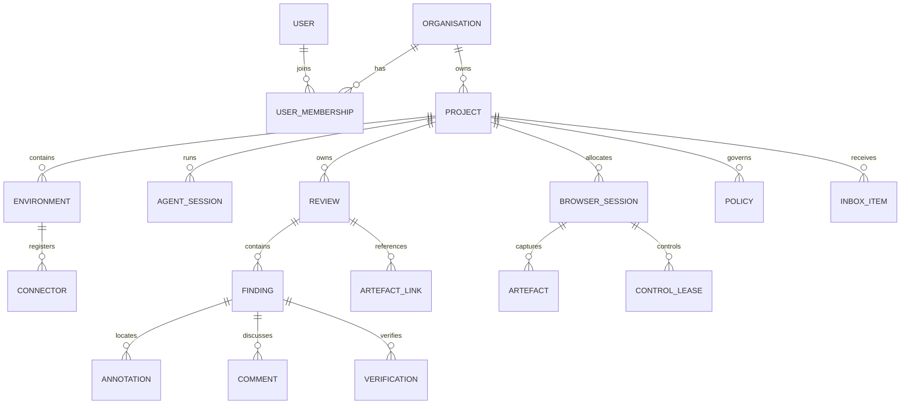

# Domain Model

## 1. Purpose

This document defines the authoritative product vocabulary, entity boundaries, ownership rules and lifecycles. Database schemas and API types may evolve, but they must preserve these semantics unless changed by ADR.

## 2. Aggregate overview



## 3. Identity rules

- Every durable entity has an immutable opaque ID.
- Human-friendly names and slugs are mutable aliases.
- IDs must not encode tenant, timestamp, database sequence or security-sensitive data.
- All project-owned records include `organisation_id` and `project_id` for defence-in-depth filtering.
- External references use scoped IDs and never rely on display names alone.

Recommended ID form:

```text
org_...   organisation
prj_...   project
env_...   environment
con_...   connector
wsp_...   workspace
svc_...   published service (route)
ags_...   agent session
brs_...   browser session
rev_...   review
fin_...   finding
ann_...   annotation
art_...   artefact
ver_...   verification
evt_...   event
```

ULID-compatible sortable identifiers are acceptable, but consumers must treat them as opaque. Prefixes are a debugging convenience: protocol schemas and validators must bound an identifier's length and character class only, and must never require its prefix.

## 4. Organisation

The top-level administrative and data-isolation boundary.

### Required fields

- `id`
- `name`
- `slug`
- `status`
- `created_at`
- `updated_at`

### Responsibilities

- Owns projects, users, policies and encryption configuration
- Defines default retention and authentication policy
- Provides the audit boundary

### Invariants

- Cross-organisation access is denied by default
- Organisation deletion requires an explicit retention and export workflow

## 5. User and membership

A user is a human identity. Organisation membership grants roles.

### Initial roles

- `owner`
- `administrator`
- `reviewer`
- `operator`
- `viewer`

Role capabilities must be represented as permissions internally rather than hard-coded throughout services.

### Important permissions

- Manage organisation
- Manage projects
- Register connectors
- View live sessions
- Take browser control
- Create reviews
- Accept findings
- Manage secrets
- Change retention
- View audit records

## 6. Project

A project is the principal working boundary.

### Fields

- `id`
- `organisation_id`
- `name`
- `slug`
- `repository_identity`
- `default_branch`
- `status`
- `settings`
- `created_at`
- `updated_at`

### Repository identity

Repository identity is normalised and provider-agnostic:

```json
{
  "canonical": "github.com/example/refresh-surplus",
  "clone_urls": [
    "git@github.com:example/refresh-surplus.git",
    "https://github.com/example/refresh-surplus.git"
  ]
}
```

### Project owns

- Environments
- Agent sessions
- Browser sessions
- Reviews
- Policies
- Inbox items
- Project-scoped secrets references

### Invariants

- A review belongs to exactly one project
- Browser sessions may only route to services authorised for the same project
- Repository association changes are audited

## 7. Environment

A registered development location such as a VM or workstation.

### Fields

- `id`
- `project_id` or authorised project set
- `name`
- `platform`
- `architecture`
- `labels`
- `trust_level`
- `status`
- `last_seen_at`

An environment may host multiple workspaces and projects, but each published service and session association must be explicitly project-scoped.

## 8. Connector

A connector installation and cryptographic identity.

### Fields

- `id`
- `environment_id`
- `certificate_fingerprint`
- `version`
- `capabilities`
- `status`
- `connected_at`
- `last_heartbeat_at`
- `revoked_at`

`certificate_fingerprint` is the `sha256:<hex>` digest of the DER form of the issued client certificate (ADR-0014). It is unique across connectors and is how a verified peer certificate is resolved to this record, on both the control channel and the tunnel gateway's data channel.

### Lifecycle

```text
PENDING_ENROLMENT
  -> ACTIVE
  -> DEGRADED
  -> DISCONNECTED
  -> REVOKED
```

The record enters `PENDING_ENROLMENT` when the registration exchange issues its identity, and `ACTIVE` when it first opens an authenticated channel. `DEGRADED` and `DISCONNECTED` are conclusions the control plane draws from heartbeat silence, never self-reports (`CONNECTOR_PROTOCOL.md` §8); a heartbeat from either state returns the connector to `ACTIVE`. Every transition records an event with actor type `connector` (`EVENTS.md` §5, §7).

A revoked connector cannot reuse its prior credentials. Revocation is terminal: the connector is refused before the channel is established and MUST NOT retry with the refused identity. Re-enrolment creates a new connector record with a new identity.

## 9. Workspace

A repository checkout detected by a connector.

### Fields

- `id`
- `environment_id`
- `project_id`
- `path_hash`
- `display_path`
- `repository_identity`
- `branch`
- `head_commit`
- `dirty`
- `last_observed_at`

The control plane should avoid storing unnecessary full filesystem paths when a display label and stable local hash are sufficient.

## 10. Published service

A temporary route from an authorised browser worker to a local development service.

### Fields

- `id`
- `project_id`
- `connector_id`
- `workspace_id`
- `local_host`
- `local_port`
- `protocol`
- `public_alias`
- `scope`
- `expires_at`
- `status`

### Invariants

- The route is not generally internet-public
- Access requires a session-scoped capability
- Default local host is loopback
- Publication expires automatically
- Browser workers cannot use publication as a generic network proxy

## 11. Agent session

A bounded agent execution context.

### Fields

- `id`
- `project_id`
- `connector_id`
- `workspace_id`
- `agent_type`
- `agent_version`
- `capabilities`
- `branch`
- `head_commit`
- `status`
- `started_at`
- `ended_at`

### Statuses

```text
STARTING
ACTIVE
WAITING
BLOCKED
DISCONNECTED
COMPLETED
FAILED
CANCELLED
```

### Invariants

- Agent identity and human identity are distinct actors
- An agent session cannot grant itself permissions beyond its issued capability set
- Session completion does not accept reviews automatically

## 12. Browser session

Represents allocated browser execution.

### Fields

- `id`
- `project_id`
- `worker_id`
- `agent_session_id`
- `published_service_id`
- `browser_type`
- `browser_version`
- `status`
- `current_controller`
- `control_epoch`
- `retention_policy`
- `created_at`
- `ended_at`

### Statuses

```text
REQUESTED
ALLOCATING
READY
ACTIVE
PAUSED
DEGRADED
TERMINATING
TERMINATED
FAILED
```

### Invariants

- Exactly one interactive controller at a time
- Browser profiles are ephemeral unless persistence is explicitly enabled
- Each command is authorised against project, session and control epoch
- Live frames are not durable by default

## 13. Control lease

Time-bounded control grant.

### Fields

- `id`
- `browser_session_id`
- `controller_type`: `agent`, `human`, `system`
- `controller_id`
- `epoch`
- `issued_at`
- `expires_at`
- `revoked_at`
- `reason`

Only one non-revoked interactive lease may exist for the current epoch.

## 14. Review

The durable collaboration package.

### Fields

- `id`
- `project_id`
- `slug`
- `title`
- `description`
- `status`
- `priority`
- `created_by`
- `assigned_user_id`
- `assigned_agent_session_id`
- `captured_branch`
- `captured_commit`
- `captured_workspace_id`
- `source_browser_session_id`
- `created_at`
- `updated_at`
- `closed_at`

### Statuses

```text
DRAFT
READY
ASSIGNED
IN_PROGRESS
AWAITING_HUMAN_REVIEW
CHANGES_REQUESTED
ACCEPTED
CANCELLED
ARCHIVED
```

### Invariants

- Slug is unique within active reviews in a project
- Accepted reviews are immutable except for archival metadata and comments
- Reopening an accepted review creates a new review revision or explicit reopen event
- A review may contain findings captured from multiple pages and sessions

## 15. Finding

One actionable unit inside a review.

### Fields

- `id`
- `review_id`
- `title`
- `description`
- `severity`
- `status`
- `source`
- `url`
- `viewport`
- `scroll_position`
- `captured_commit`
- `element_context`
- `acceptance_criteria`
- `claimed_by`
- `created_at`
- `updated_at`

### Severities

- `critical`
- `high`
- `medium`
- `low`
- `suggestion`

### Statuses

```text
OPEN
CLAIMED
IN_PROGRESS
BLOCKED
FIXED_UNVERIFIED
AWAITING_HUMAN_REVIEW
RESOLVED
REOPENED
WONT_FIX
DUPLICATE
```

### Authority rules

- Human-created findings require human acceptance
- Agent-created findings may be auto-resolved by policy if configured
- `WONT_FIX` requires a human decision or explicit project policy
- Reopening preserves prior verification history

## 16. Annotation

Structured geometry and display metadata.

### Common fields

- `id`
- `finding_id`
- `artefact_id`
- `type`
- `geometry`
- `label`
- `style_hint`
- `created_by`
- `created_at`

### Supported initial types

- `rectangle`
- `ellipse`
- `arrow`
- `point`
- `numbered_marker`
- `freehand`

### Geometry

Coordinates are normalised to the artefact content rectangle:

```json
{
  "x": 0.54,
  "y": 0.02,
  "width": 0.38,
  "height": 0.11
}
```

All values must be between 0 and 1. Rotation and path data are versioned by annotation type.

## 17. Element context

Optional semantic link to an element:

```json
{
  "selector": "[data-testid=main-navigation]",
  "selector_strategy": "testid",
  "role": "navigation",
  "accessible_name": "Main navigation",
  "text_excerpt": "Shop Sell About",
  "bounding_box_css_pixels": {
    "x": 411,
    "y": 18,
    "width": 292,
    "height": 82
  },
  "dom_fingerprint": "sha256:..."
}
```

Selectors are hints, not permanent identity. Reproduction must tolerate changed DOM.

## 18. Comment

A chronological discussion item on a review or finding.

Comments may be authored by humans, agents or system actors. Actor type must always be explicit.

Comments are append-only. Editing creates a new revision and retains history.

## 19. Verification

A submitted claim with evidence that a finding is resolved.

### Fields

- `id`
- `finding_id`
- `submitted_by_actor`
- `status`
- `summary`
- `branch`
- `commit`
- `tested_viewports`
- `checks`
- `artefact_links`
- `submitted_at`
- `reviewed_at`
- `reviewed_by`

### Statuses

- `submitted`
- `accepted`
- `rejected`
- `superseded`

### Checks example

```json
{
  "reproduced_before": true,
  "console_errors_reviewed": true,
  "network_failures_reviewed": true,
  "accessibility_checked": false,
  "tests": [
    {"name": "homepage responsive smoke", "status": "passed"}
  ]
}
```

## 20. Artefact

Metadata for binary evidence stored outside PostgreSQL.

### Fields

- `id`
- `organisation_id`
- `project_id`
- `kind`
- `storage_key`
- `content_type`
- `size_bytes`
- `sha256`
- `encryption_key_reference`
- `redaction_state`
- `retention_class`
- `created_at`
- `expires_at`

### Initial kinds

- screenshot
- thumbnail
- trace
- HAR
- video
- DOM snapshot
- accessibility snapshot
- console log
- network log
- review export

## 21. Inbox item

A durable work notification.

### Fields

- `id`
- `project_id`
- `recipient_type`
- `recipient_id`
- `type`
- `title`
- `payload`
- `status`
- `created_at`
- `acknowledged_at`
- `completed_at`

### Statuses

- `pending`
- `acknowledged`
- `completed`
- `dismissed`
- `expired`

Inbox retrieval must be idempotent. Acknowledgement does not imply task completion.

## 22. Policy

A versioned set of rules governing browser actions, completion evidence, retention, redaction and approvals.

Policies must be evaluated with explicit input and produce a recorded decision:

```json
{
  "decision": "require_approval",
  "policy_id": "pol_...",
  "policy_version": 3,
  "reasons": ["production hostname", "form submission"]
}
```

## 23. Event

Immutable record of a meaningful occurrence. See `EVENTS.md`.

Events are not a substitute for current-state tables. Current state is queryable directly; events provide audit, timeline and integration semantics.

## 24. Staleness

A review or finding is stale when its captured source context differs materially from the current workspace.

Signals include:

- Branch differs
- Commit differs
- Referenced files changed
- Selector no longer resolves
- Route no longer exists
- Viewport or feature flags are unavailable

Staleness is a warning and workflow input, not automatic invalidation. The agent must reproduce the issue against current code.
