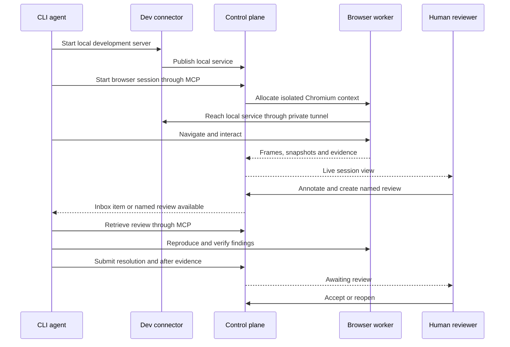

# Product Definition

## 1. Purpose

ReviewPlane is a private, self-hosted visual collaboration, supervision and evidence platform for human-AI software development.

It connects:

- Human reviewers
- CLI coding agents
- Development VMs and workstations
- Centrally managed browser sessions
- Source-control context
- Durable visual reviews
- Verification evidence

The product lets a human watch what an agent is doing in an application, annotate a problem, package that feedback as a named review, send or assign it to an agent, and require verified before-and-after evidence before acceptance.

## 2. Problem

AI coding agents can edit code and run browser automation, but the human often cannot see what the agent sees or understand what it actually verified. Current workflows commonly involve:

- Screenshots copied manually between tools
- Ambiguous text such as "the thing in the top-right"
- Browser sessions trapped inside remote VMs
- Lost feedback when a CLI session ends
- Agents claiming a visual issue is fixed without reproducing it
- No durable link between feedback, code changes and verification
- Sensitive code and application data being sent through third-party services
- No safe mechanism for human takeover or approval

The result is low trust, repeated explanation and weak auditability.

## 3. Product proposition

> Annotate a live application, assign the visual review to a CLI coding agent, and receive verified before-and-after evidence, entirely inside infrastructure you control.

## 4. Target users

### Initial users

Technical individual developers and small engineering teams who:

- Run Claude Code, OpenCode, Codex or similar agents
- Use remote development VMs, homelabs or self-hosted environments
- Build browser-based products
- Need privacy and control over screenshots, traces and source context
- Are comfortable deploying Docker Compose and a lightweight connector

### Later users

- Platform engineering teams
- Regulated organisations
- Public-sector engineering teams
- Financial, defence and security-sensitive organisations
- Managed service providers operating isolated customer environments

## 5. Core jobs to be done

### Human reviewer

- See the application state the agent is using
- Understand what the agent is doing now
- Point at a precise visual problem
- Attach a clear comment and acceptance expectation
- Send feedback without manually copying screenshots into a terminal
- Review the agent's evidence and accept or reopen the finding

### Coding agent

- Discover browser and review capabilities through MCP
- Retrieve a named review in the current project
- Receive structured coordinates, selectors, URL, viewport and comments
- Reproduce the issue against current code
- Fix findings one at a time
- Submit evidence and an implementation summary
- Know exactly what remains blocked or awaiting human review

### Administrator

- Deploy the platform without mandatory cloud dependencies
- Keep application and review data inside controlled infrastructure
- Control retention, encryption, access and browser isolation
- Audit who did what and when
- Scale browser capacity separately from the control plane

## 6. Primary product loop

## 7. Central domain object

The durable product object is the **review**.

A review survives:

- Browser session termination
- Agent CLI restart
- Development VM restart
- Agent-provider change
- Branch movement
- Assignment to another person or agent

A review contains findings, evidence, annotations, comments, source-control context, assignment and acceptance history.

The browser session is an execution surface. It is not the system of record.

## 8. Core capabilities

### 8.1 Centrally managed browsers

- Chromium runs in isolated browser-worker containers
- The agent interacts through MCP tools
- The human can view the same session
- Dev applications remain on development VMs
- A connector provides outbound-only private routing

### 8.2 Live supervision

- Live browser frames
- Current URL and viewport
- Agent activity timeline
- Agent cursor and intended target
- Console and network evidence
- Pause, guide and human takeover

### 8.3 Visual reviews

- Draw rectangles, circles, arrows and markers
- Add comments, severity and acceptance criteria
- Attach DOM and accessibility context where available
- Group findings into a named review
- Assign to a project, user or agent session

### 8.4 Agent context delivery

- MCP tools and resources
- Named lookup such as `bugs-on-homepage`
- Project-scoped inbox
- Explicit `/review` style workflow in compatible clients
- Managed-message delivery only as a later adapter capability

### 8.5 Closed-loop verification

- Recreate recorded URL and viewport
- Reproduce against current branch
- Detect staleness from commit and file changes
- Capture after evidence
- Compare before and after
- Require human acceptance for human-authored findings

### 8.6 Privacy and governance

- Self-hosted by default
- Customer-owned storage
- Customer-controlled encryption and retention
- No mandatory telemetry
- Secret redaction and injection
- Browser isolation and policy gates
- Audit event history

## 9. Product differentiators

The product is not differentiated by browser automation alone or by drawing annotations alone. The differentiation is the integrated workflow:

1. Distributed development environments
2. Central browser execution
3. Shared live supervision
4. Durable named reviews
5. Structured human-to-agent context
6. Before-and-after verification
7. Human acceptance authority
8. Self-hosted privacy and governance

## 10. Scope for the first usable release

The first usable release supports:

- Single-organisation, single-user deployment
- Multiple projects
- Multiple development connectors
- One or more browser workers
- Chromium only
- Browser-only live viewing
- Named reviews and findings
- Screenshot annotations
- MCP review retrieval
- Agent inbox polling
- Git branch and commit correlation
- Before-and-after evidence
- Human accept and reopen
- Docker Compose deployment
- Local authentication
- PostgreSQL and pluggable artefact storage

## 11. Explicit non-goals

The initial product is not:

- A replacement for a coding agent
- A cloud IDE
- A general remote desktop platform
- A Git hosting service
- A full project-management suite
- A full CI/CD orchestrator
- A model gateway
- A general-purpose browser automation framework
- A full observability platform for all software agents
- A design-generation product
- A generic bug tracker

Integrations are preferred over replacing mature adjacent systems.

## 12. Product principles

- Evidence over claims
- Human authority over agent completion
- Privacy by deployment, not by promise alone
- Structured context over screenshot-only context
- Reviews survive sessions
- Agent-agnostic protocols
- Safe failure over silent continuation
- Minimal public exposure
- Useful personal deployment before enterprise complexity

See `DESIGN_PRINCIPLES.md` for normative detail.

## 13. Success measures

### Adoption

- Successful self-hosted installations
- Connected development environments per installation
- Active projects and named reviews

### Workflow value

- Findings created and resolved
- Median time from review creation to verification
- Percentage of findings accepted without reopening
- Percentage of UI changes with browser evidence
- Number of manual screenshot-copy steps eliminated

### Reliability

- Browser allocation success rate
- Connector reconnection success rate
- Tunnel establishment latency
- Artefact upload completion rate
- Session recovery rate

### Trust and safety

- Rejected stale-control commands
- Redaction detections
- Approval-gate denials
- Audit coverage for state transitions
- Security incidents involving cross-project or cross-session access

## 14. Commercial and open-source direction

The architecture must permit an open-core or fully open-source model without weakening the self-hosted product.

Likely universally available capabilities:

- Connector
- MCP interface
- Browser worker
- Core review workflow
- Docker Compose deployment
- Review export format

Possible paid enterprise capabilities:

- SAML and advanced SSO
- Advanced organisation RBAC
- Compliance reports
- Policy packs
- External KMS integrations
- Enterprise support and long-term support releases

Privacy, core reviews and self-hosting must not be artificially crippled.

## 15. Product risks

| Risk | Mitigation |
|---|---|
| Adjacent products add similar annotation flows | Focus on durable reviews, distributed VMs, verification and governance |
| Browser infrastructure consumes engineering effort | Use Playwright and narrow Chromium support initially |
| Agent clients vary in MCP capability | Capability negotiation and agent adapters |
| Live streaming increases complexity | Separate ephemeral frames from persisted evidence |
| Privacy promise is undermined by model providers | Make external model flow explicit and configurable |
| Product becomes a generic agent platform | Enforce non-goals and review-centred roadmap |
| Remote tunnel creates attack surface | Outbound connectors, scoped routes, short-lived credentials and network policy |

## 16. Terminology

Use the terms defined in `GLOSSARY.md` and `DOMAIN_MODEL.md`. Avoid introducing synonyms for `review`, `finding`, `browser session`, `agent session`, `connector` or `verification` without updating those documents.
